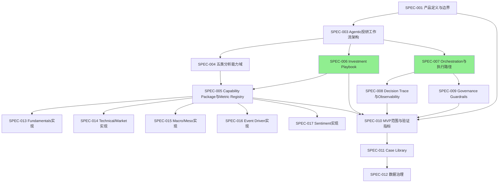

# CrossLens Specs

> **CrossLens** 是一个可编排、可审计、可复盘的结构化投研与决策辅助系统。

Architecture Constitution: **Deterministic first, Agentic when necessary, Traceable always.**

CrossLens 的产品定位不是自动荐股或自动交易，而是把投资判断拆成可追踪对象，帮助用户减少逻辑漂移、证据污染和复盘失真。

核心分层：

```text
Domain = 分析原语
Workflow = 域内或跨域执行流程
Strategy / Playbook = 对一个或多个域能力的组合与约束
```

五个域都应能独立 workflow 化，但不默认等同为五个独立策略。真正的策略判断发生在 Playbook 层，由一个或多个域的 Analysis Card、Constraint Export、Conflict Report 和 Guardrail 组合形成。

---

## 文档索引

> **版本、状态、规范性枚举、Schema 来源、依赖关系均已收口到 [SPEC-REGISTRY.md](./SPEC-REGISTRY.md)。** 本表仅提供文件名链接与一句话定位；以 Registry 为唯一事实源。

| 编号 | 文件 | 核心定位 |
|------|------|----------|
| SPEC-001 | [产品定义与边界](./SPEC-001%20产品定义与边界%20v0.4.md) | 产品是什么/不是什么，七层架构边界 |
| SPEC-002 | [目标用户与核心场景](./SPEC-002%20目标用户与核心场景%20v0.1.md) | 用户画像、场景、路由决策树 |
| SPEC-003 | [Agentic投研工作流架构](./SPEC-003%20Agentic投研工作流架构%20v0.3.4.md) | 七层架构、核心对象链、标准 Workflow |
| SPEC-004 | [五类分析能力域与Analysis Card Schema](./SPEC-004%20五类分析能力域与%20Analysis%20Card%20Schema%20v0.2.7.md) | 5个能力域定义、Analysis Card Schema |
| SPEC-005 | [Capability Package与Metric Registry](./SPEC-005%20Capability%20Package%20与%20Metric%20Registry%20规范%20v0.2.md) | 工具/模型打包、指标注册与解析、Evidence confidence规则 |
| SPEC-006 | [Investment Playbook 规范](./SPEC-006%20Investment%20Playbook%20规范%20v0.3.0.md) | 投资决策手册、约束执行语义 |
| SPEC-007 | [Orchestration与执行路径](./SPEC-007%20Orchestration%20与执行路径%20v0.6.md) | 运行状态机、编排图、路由决策 |
| SPEC-008 | [Decision Trace与Observability](./SPEC-008%20Decision%20Trace%20与%20Observability%20v0.1.md) | 决策追踪四层结构、可观测性 |
| SPEC-009 | [Governance Guardrails Evaluator 与人工介入](./SPEC-009%20Governance%20Guardrails%20Evaluator%20与人工介入%20v0.1.md) | 护栏、评估器、人工审核汇聚 |
| SPEC-010 | [MVP范围与验证指标](./SPEC-010%20MVP%20范围与验证指标%20v0.1.md) | MVP范围宪法、验证标准 |
| SPEC-011 | [Case Library与历史案例记忆](./SPEC-011%20Case%20Library%20与历史案例记忆%20v0.1.md) | 案例库结构、隐私边界 |
| SPEC-012 | [数据治理与用户私有数据](./SPEC-012%20数据治理与用户私有数据%20v0.1.md) | 数据三级分类、访问控制、生命周期 |
| SPEC-013 | [Fundamentals 域实现规格](./SPEC-013%20Fundamentals%20域实现规格%20v0.2.1.md) | A股财务分析域 Pipeline、metric 计算、Evidence 边界 |
| SPEC-014 | [Technical/Market 域实现规格](./SPEC-014%20Technical%20Market%20域实现规格%20v0.2.3.md) | 技术面三层架构 + Part II 高阶扩展（regime/RS/风险/支撑阻力/MTF） |
| SPEC-015 | [Macro/Meso 域实现规格](./SPEC-015%20Macro%20Meso%20域实现规格%20v0.1.1.md) | 宏观/中观消费者域 Pipeline、global_liquidity_metrics、3 Context 子 stance |
| SPEC-016 | [Event Driven 域实现规格](./SPEC-016%20Event%20Driven%20域实现规格%20v0.1.0.md) | 事件驱动域 Pipeline、预期差判断、可交易性评分、受益链条映射 |
| SPEC-017 | [Sentiment 域实现规格](./SPEC-017%20Sentiment%20域实现规格%20v0.1.0.md) | 情绪/叙事 P0 skeleton、soft-only exports、拥挤与反身性风险 |

**辅助文件：**
| 文件 | 说明 |
|------|------|
| [SPEC-REGISTRY](./SPEC-REGISTRY.md) | 全仓库规格注册表——版本、状态、规范性枚举/schema、依赖关系、可执行覆盖 |
| [SPEC-006 CHANGELOG](./executable_specs/spec006/CHANGELOG.md) | SPEC-006 详细版本变更历史 |
| [Executable Specs](./executable_specs/) | SPEC-006 Python 可执行规格（决策逻辑、Pydantic 契约、边界测试） |

> ⚠️ **全仓库枚举一致性规则：** `domain` 枚举（5 values）、`generation_type`、`domain_status`、`OverallResult` 等规范性枚举的唯一定义源见 [SPEC-REGISTRY.md](./SPEC-REGISTRY.md)。任何 SPEC 中使用这些枚举必须以 Registry 为准。

---

## 阅读顺序

### 新人入门路径

```
1. SPEC-001 (产品定义) ── 先理解产品定位和核心概念
2. SPEC-010 (MVP范围) ── 了解MVP交付什么、不交付什么
3. SPEC-003 (架构)    ── 深入七层架构和核心对象链
4. SPEC-007 (编排)    ── 理解任务如何从输入走到输出
5. 实现域时阅读 SPEC-013/014/015/016/017；治理/复盘时跳读 SPEC-008/009/011/012
```

### 实现者路径（按依赖关系）

```
SPEC-001 (产品定义)
  ├─► SPEC-003 (架构)
  │     ├─► SPEC-004 (能力域) ──► SPEC-005 (能力包)
  │     │                      ├─► SPEC-013 (Fundamentals 实现)
  │     │                      ├─► SPEC-014 (Technical/Market 实现)
  │     │                      ├─► SPEC-015 (Macro/Meso 实现)
  │     │                      ├─► SPEC-016 (Event Driven 实现)
  │     │                      └─► SPEC-017 (Sentiment 实现)
  │     ├─► SPEC-006 (Playbook) ──► SPEC-005 (指标注册)
  │     └─► SPEC-007 (编排) ──► SPEC-008 (决策追踪)
  │                              └─► SPEC-009 (治理)
  └─► SPEC-010 (MVP范围) ──► SPEC-011 (案例库) ──► SPEC-012 (数据治理)
```

---

## 文档关系图

> ⚠️ **本图为派生视图。** Canonical dependency graph 以 [SPEC-REGISTRY.md](./SPEC-REGISTRY.md) 为准。当本图与 Registry 不一致时，Registry 优先。



> 🟢 绿色节点 = Approved 状态；其余为 Draft/Review。

---

## 核心概念速览

### 架构宪法

> **Deterministic first, Agentic when necessary, Traceable always.**
> 确定性优先；必要时才使用 Agentic 推理；全过程必须可追踪。

### 七层架构

1. User Interaction Layer — 用户输入、结果展示、复盘入口
2. Task Understanding & Routing Layer — 自然语言→Investment Task
3. Context & Evidence Layer — Context Bundle + Evidence Packets
4. Orchestration Layer — 驱动全流程，调度 Workflow 节点
5. Execution Layer — 五个分析能力域运行
6. Review & Governance Layer — Validation、Conflict、Playbook、Guardrail
7. Decision & Trace Layer — Decision Candidate + Decision Trace

### 核心对象链

```
Investment Task → Context Bundle → Evidence Packets → Analysis Domain Jobs
→ Analysis Cards → Post-card Validation → Conflict Reports
→ Pre-decision Validation → Playbook Evaluation → Guardrail Report
→ Resolved Decision Bounds → Decision Candidate → Decision Trace
```

### 五个分析能力域

| 域 | 默认产品角色 |
|---|---|
| Macro / Meso | regime filter、行业/风格环境、风险预算控制 |
| Fundamentals | 中长期主逻辑、质量/价值/盈利修复判断 |
| Event Driven / Catalyst | 预期重定价、催化剂和可交易窗口判断 |
| Sentiment | 拥挤度、叙事扩散、反身性风险和反方证据 |
| Technical / Market | 交易时机、价格行为确认和风险控制 |

### 执行深度

CrossLens 支持三类产品化执行深度：

| `depth` | 产品标签 | 适用场景 | 域调度 |
|---|---|---|---|
| `quick` | Quick Check | 快速判断一个问题是否值得继续研究 | 只跑相关域 |
| `standard` | Standard Review | 常规投研复核或单个决策前检查 | 2~3 个关键域 + Playbook |
| `deep` | Full Decision | 严肃决策、冲突检查、复盘留痕 | 五域 + Conflict + Guardrail + Trace |

当前 MVP 按实现阶段分层：MVP-0 以 `standard` 三域 runtime（Fundamentals、Technical/Market、Macro/Meso）验证端到端闭环和最小 Trace；MVP-0.5 以 fixture/mock `deep` 五域 golden path 验证 runtime 和报告链路，但不等于完整 MVP-1；MVP-1 以真实数据 `deep` 五域 Full Decision 验证完整四层 Trace 与基础 Event Log。

SPEC-007 v0.6 已补充 depth-aware domain planning：`quick` / `standard` / `deep` 先决定进入 `DomainPlan` 的能力域，再沿用统一的 Domain Dispatch、Conflict、Guardrail 与 Trace 语义。

---

## Executable Specs

可执行规格从 SPEC-006 起步，按 Registry 计划逐步覆盖 005 → 004 → 009。

| 包 | 位置 | 覆盖规范 | 状态 |
|----|------|----------|------|
| `crosslens_spec003` | [executable_specs/spec003/](./executable_specs/spec003/) | SPEC-003: InvestmentTask, AssetInfo, ContextBundle, EvidencePacket, AnalysisDomainJob, PostCardValidationReport, ConflictReport, DecisionCandidate, URI resolver | ✅ 已验证 (80 tests) |
| `crosslens_spec006` | [executable_specs/spec006/](./executable_specs/spec006/) | SPEC-006: aggregate_multi_rule, compute_overall_result, resolve_recommended_actions, merge_confidence_cap | ✅ 已验证 (29 tests) |
| `crosslens_spec005` | [executable_specs/spec005/](./executable_specs/spec005/) | SPEC-005: MetricRegistryEntry, FactRegistryEntry, LabelRegistryEntry, DerivedMetricRuleTable | ✅ 已验证 (17 tests) |
| `crosslens_spec004` | [executable_specs/spec004/](./executable_specs/spec004/) | SPEC-004: AnalysisCard, ConstraintExport, DataFreshness, post-card validation rules | ✅ 已验证 (30 tests) |
| `crosslens_spec009` | [executable_specs/spec009/](./executable_specs/spec009/) | SPEC-009: apply_guardrails, run_evaluator, compute_final_confidence_cap, resolve_decision_bounds, check_evidence_contamination | ✅ 已验证 (60 tests) |

运行:
```
cd executable_specs/spec003 && python -m pytest
cd executable_specs/spec006 && python -m pytest
cd executable_specs/spec005 && python -m pytest
cd executable_specs/spec004 && python -m pytest
cd executable_specs/spec009 && python -m pytest
```

---

## 未来规划

> SPEC-013/014/015/016/017 已进入正式文档索引（上方）。下表仅列尚未起稿的规划项；版本/状态以 [SPEC-REGISTRY.md](./SPEC-REGISTRY.md) 为唯一事实源。

| 编号 | 定位 | 状态 |
|------|------|------|
| — | 暂无 | — |

---

## 版本策略

- 每个 SPEC 独立版本号（SemVer），在文档头声明依赖文档的版本
- 版本号必须嵌入文件名（如 `v0.3.4`），防止重名歧义
- SPEC-006 的 CHANGELOG 独立于 SPEC 编号体系
- 唯事实源见 [SPEC-REGISTRY.md](./SPEC-REGISTRY.md)
