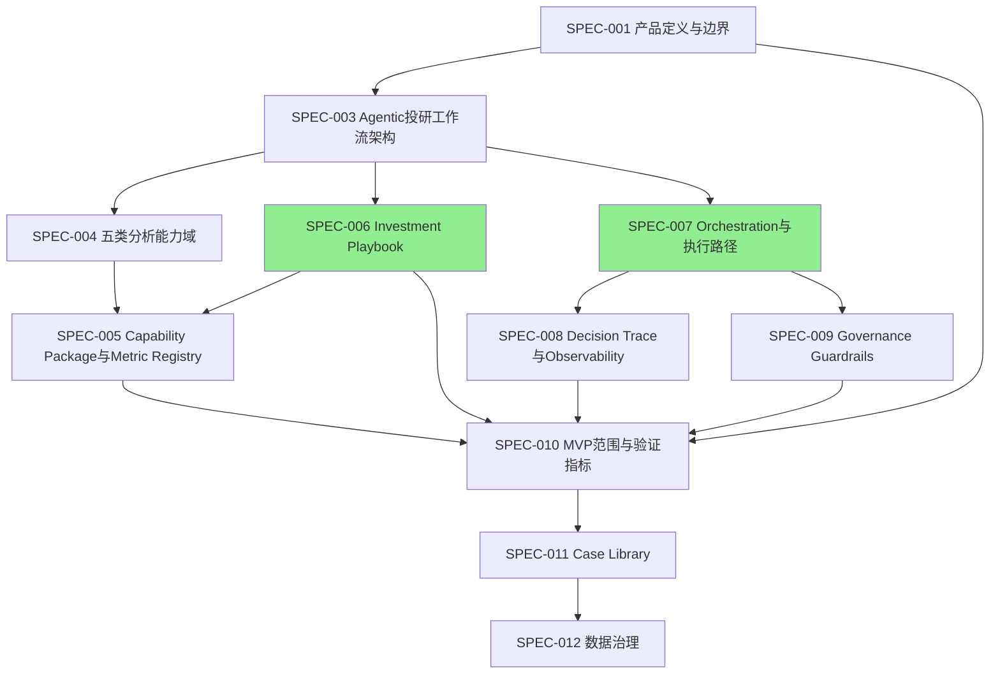

# CrossLens Specs

> **CrossLens** 是一个可编排、可审计、可复盘的 Agentic 投研决策工作流系统。

Architecture Constitution: **Deterministic first, Agentic when necessary, Traceable always.**

---

## 文档索引

| 编号 | 文件 | 版本 | 状态 | 核心定位 |
|------|------|------|------|----------|
| SPEC-001 | [产品定义与边界](./SPEC-001%20产品定义与边界.md) | v0.4 | Draft | 产品是什么/不是什么，七层架构边界 |
| SPEC-002 | [目标用户与核心场景](./SPEC-002%20目标用户与核心场景.md) | v0.1 | Draft | 用户画像、场景、路由决策树 |
| SPEC-003 | [Agentic投研工作流架构](./SPEC-003%20Agentic投研工作流架构%20v0.3.4.md) | v0.3.4 | Review | 七层架构、核心对象链、标准 Workflow |
| SPEC-004 | [五类分析能力域与Analysis Card Schema](./SPEC-004%20五类分析能力域与%20Analysis%20Card%20Schema%20v0.2.5.md) | v0.2.5 | Review | 5个能力域定义、Analysis Card Schema |
| SPEC-005 | [Capability Package与Metric Registry](./SPEC-005%20Capability%20Package%20与%20Metric%20Registry%20规范.md) | v0.2 | Review | 工具/模型打包、指标注册与解析、Evidence confidence规则 |
| SPEC-006 | [Investment Playbook 规范](./SPEC-006%20Investment%20Playbook%20规范%20v0.3.0.md) | v0.3.0 | Approved | 投资决策手册、约束执行语义 |
| SPEC-007 | [Orchestration与执行路径](./SPEC-007%20Orchestration%20与执行路径.md) | v0.6 | Approved | 运行状态机、编排图、路由决策 |
| SPEC-008 | [Decision Trace与Observability](./SPEC-008%20Decision%20Trace%20与%20Observability.md) | v0.1 | Draft | 决策追踪四层结构、可观测性 |
| SPEC-009 | [Governance Guardrails Evaluator 与人工介入](./SPEC-009%20Governance%20Guardrails%20Evaluator%20与人工介入.md) | v0.1 | Draft | 护栏、评估器、人工审核汇聚 |
| SPEC-010 | [MVP范围与验证指标](./SPEC-010%20MVP%20范围与验证指标.md) | v0.1 | Draft | MVP范围宪法、验证标准 |
| SPEC-011 | [Case Library与历史案例记忆](./SPEC-011%20Case%20Library%20与历史案例记忆.md) | v0.1 | Draft | 案例库结构、隐私边界 |
| SPEC-012 | [数据治理与用户私有数据](./SPEC-012%20数据治理与用户私有数据.md) | v0.1 | Draft | 数据三级分类、访问控制、生命周期 |

**辅助文件：**
| 文件 | 说明 |
|------|------|
| [SPEC-REGISTRY](./SPEC-REGISTRY.md) | 全仓库规格注册表——版本、状态、规范性枚举/schema、依赖关系、可执行覆盖 |
| [SPEC-006-CHANGELOG](./SPEC-006-CHANGELOG.md) | SPEC-006 详细版本变更历史 |
| [Executable Specs](./executable_specs/) | SPEC-006 Python 可执行规格（决策逻辑、Pydantic 契约、边界测试） |

> ⚠️ **全仓库枚举一致性规则：** `domain` 枚举（5 values）、`generation_type`、`domain_status`、`OverallResult` 等规范性枚举的唯一定义源见 [SPEC-REGISTRY.md](./SPEC-REGISTRY.md)。任何 SPEC 中使用这些枚举必须以 Registry 为准。

---

## 阅读顺序

### 新人入门路径

```
1. SPEC-001 (产品定义) ── 先理解产品定位和核心概念
2. SPEC-010 (MVP范围) ── 了解MVP交付什么、不交付什么
3. SPEC-003 (架构)    ── 深入七层架构和核心对象链
4. SPEC-007 (编排)    ── 理解任务如何从输入走到输出
5. 然后按兴趣跳读 SPEC-004/005/006/008/009/011/012
```

### 实现者路径（按依赖关系）

```
SPEC-001 (产品定义)
  ├─► SPEC-003 (架构)
  │     ├─► SPEC-004 (能力域) ──► SPEC-005 (能力包)
  │     ├─► SPEC-006 (Playbook) ──► SPEC-005 (指标注册)
  │     └─► SPEC-007 (编排) ──► SPEC-008 (决策追踪)
  │                              └─► SPEC-009 (治理)
  └─► SPEC-010 (MVP范围) ──► SPEC-011 (案例库) ──► SPEC-012 (数据治理)
```

---

## 文档关系图

> ⚠️ **本图为派生视图。** Canonical dependency graph 以 [SPEC-REGISTRY.md](./SPEC-REGISTRY.md) 为准。当本图与 Registry 不一致时，Registry 优先。



> 🟢 绿色节点 = Approved 状态；其余为 Draft/Review。

---

## 核心概念速览

### 架构宪法

> **Deterministic first, Agentic when necessary, Traceable always.**
> 确定性优先；必要时才使用 Agentic 推理；全过程必须可追踪。

### 七层架构

1. User Interaction Layer — 用户输入、结果展示、复盘入口
2. Task Understanding & Routing Layer — 自然语言→Investment Task
3. Context & Evidence Layer — Context Bundle + Evidence Packets
4. Orchestration Layer — 驱动全流程，调度 Workflow 节点
5. Execution Layer — 五个分析能力域运行
6. Review & Governance Layer — Validation、Conflict、Playbook、Guardrail
7. Decision & Trace Layer — Decision Candidate + Decision Trace

### 核心对象链

```
Investment Task → Context Bundle → Evidence Packets → Analysis Domain Jobs
→ Analysis Cards → Post-card Validation → Conflict Reports
→ Pre-decision Validation → Playbook Evaluation → Guardrail Report
→ Resolved Decision Bounds → Decision Candidate → Decision Trace
```

### 五个分析能力域

1. Macro / Meso — 宏观/中观环境
2. Fundamentals — 基本面分析（MVP 必要条件）
3. Company Event / Catalyst — 公司事件/催化剂
4. Sentiment — 市场情绪
5. Technical / Market — 技术/市场

---

## Executable Specs

`executable_specs/spec006/` 包含 SPEC-006 关键决策语义的 Python 实现：

- `aggregate_multi_rule` — `all`/`any` 子状态聚合
- `compute_overall_result` — 9规则决策树
- `resolve_recommended_actions` — Hard fail 动作收窄
- `merge_confidence_cap` — 多来源置信度上限合并

运行: `cd executable_specs/spec006 && python -m pytest`

详见 [executable_specs/spec006/README.md](./executable_specs/spec006/README.md)

---

## 未来规划

| 编号 | 定位 | 状态 |
|------|------|------|
| SPEC-013 | UI/API 交互契约 | 待规划 |
| SPEC-014 | 部署运维规范 | 待规划 |

---

## 版本策略

- 每个 SPEC 独立版本号（SemVer），在文档头声明依赖文档的版本
- 文件名包含主版本号（如 `v0.3.4`）
- SPEC-006 的 CHANGELOG 独立于 SPEC 编号体系
