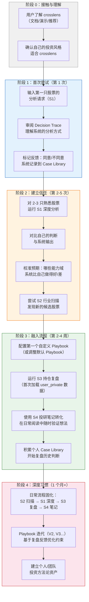

# SPEC-002：目标用户与核心场景

**版本：** v0.1
**状态：** Draft
**项目名称：** crosslens
**依赖文档：** SPEC-001 v0.4
**文档类型：** 用户定义
**目标阶段：** 产品定义

---

## 1. 任务路由决策树（Routing Decision Tree）

> **原则：先画路由决策树，再写用户和场景。路由定义了"谁在什么时候会触发什么"。**

```text
User Input（自然语言）
    │
    ▼
┌──────────────────────────────────────────┐
│  Task Understanding & Routing Layer       │
│  解析用户意图 → 分类为 InvestmentTaskType  │
└──────────────────────────────────────────┘
    │
    ├── task_type == SINGLE_STOCK_DEEP_ANALYSIS ?
    │   │   (关键词：分析、研究、怎么看、值不值得、给个判断 + 明确股票名/ticker)
    │   ├── YES → Workflow: SingleStockDeepAnalysis
    │   │   ├── playbook_selected? ──YES──→ 加载用户指定 Playbook
    │   │   └── playbook_selected? ──NO───→ 加载默认 Playbook
    │   │   └── 五能力域并行 → Analysis Cards → Conflict → Playbook Eval → Decision Candidate
    │   │
    │   └── NO → 继续路由
    │
    ├── task_type == INDUSTRY_SCAN ?
    │   │   (关键词：扫描、筛选、行业里有哪些、capex趋势、产能周期)
    │   ├── YES → Workflow: IndustryScan
    │   │   ├── 行业识别 → 成分股/可比公司拉取
    │   │   ├── 批量 Context Bundle 构建（轻量版）
    │   │   ├── Playbook Filter: 按 Hard Constraint 初筛
    │   │   └── 候选列表 + 排序理由（不展开完整 Analysis Card）
    │   │
    │   └── NO → 继续路由
    │
    ├── task_type == POSITION_REVIEW ?
    │   │   (关键词：复盘、持仓检查、该不该继续持有、要不要减仓、事件跟踪)
    │   ├── YES → Workflow: PositionReview
    │   │   ├── 加载持仓上下文（user_private）
    │   │   ├── 对每只持仓：增量 Evidence Packet（上次分析以来的变化）
    │   │   ├── Playbook 条件重检：哪些 Hard Constraint 被打破？
    │   │   └── Decision Candidate: HOLD / REDUCE / EXIT / ADD
    │   │
    │   └── NO → 继续路由
    │
    ├── task_type == RESEARCH_NOTE_TO_DECISION ?
    │   │   (关键词：笔记转决策、投研笔记、想法整理、这个逻辑对不对)
    │   ├── YES → Workflow: ResearchNoteToDecision
    │   │   ├── 解析用户笔记 → 提取 Claim / Evidence / Assumption
    │   │   ├── 对每个 Claim：检索 Evidence Packet 验证或反驳
    │   │   ├── Playbook 条件匹配：笔记中的逻辑是否触发任何 Playbook 条件？
    │   │   └── Decision Candidate + 逻辑链完整性检查
    │   │
    │   └── NO → 继续路由
    │
    └── 其他/未识别
        └── 降级为 GeneralAssist（问答模式，不生成 Decision Candidate）
```

**路由伪代码（简化）：**

```python
def route_task(user_input: str, user_context: UserContext) -> Workflow:
    # Step 1: Intent Classification
    intent = classify_intent(user_input)
    
    # Step 2: Entity Extraction
    tickers = extract_tickers(user_input)
    industries = extract_industries(user_input)
    has_position_context = user_context.has_positions()
    
    # Step 3: Routing Logic
    if intent == "DEEP_ANALYSIS" and len(tickers) == 1:
        return SingleStockDeepAnalysis(
            ticker=tickers[0],
            playbook=user_context.get_active_playbook()
        )
    
    if intent == "INDUSTRY_SCAN":
        return IndustryScan(
            industry=industries[0] if industries else user_context.topic,
            playbook=user_context.get_active_playbook()
        )
    
    if intent == "POSITION_REVIEW":
        if not has_position_context:
            return GeneralAssist("请先提供持仓信息或选择要复盘的股票")
        return PositionReview(
            positions=user_context.positions,
            playbook=user_context.get_active_playbook()
        )
    
    if intent == "RESEARCH_NOTE_TO_DECISION":
        return ResearchNoteToDecision(
            note_content=user_input,
            playbook=user_context.get_active_playbook()
        )
    
    # Fallback
    return GeneralAssist(user_input)
```

**路由决策的核心设计理念：**

1. **一个用户输入对应一个 Workflow**——系统不做多意图自由发挥；
2. **Workflow 类型决定执行深度**——SingleStockDeepAnalysis 走完整五能力域，IndustryScan 只走轻量初筛；
3. **Playbook 始终附着**——每个 Workflow 都必须绑定一个 Playbook（默认或用户指定），不做无约束分析；
4. **未识别意图不猜测**——降级为问答模式，不强行生成 Decision Candidate。

---

## 2. 目标用户画像

### 2.0 画像总览

| 画像 | 投资风格 | 周期视角 | 核心动机 |
|------|----------|----------|----------|
| P1 资本周期投资者 | 行业 capex 驱动 | 3-7 年 | 系统化 capex/产能分析 |
| P2 产业周期投资者 | 产业生命周期+供需 | 2-5 年 | 跨行业可比分析 |
| P3 中长期基本面投资者 | 质量+估值+护城河 | 3-10 年 | 结构化基本面底稿 |
| P4 独立投研分析师 | 多风格覆盖 | 灵活 | 标准化研究流程 |
| P5 AI-native 探索者 | 自定义/实验性 | 不确定 | 搭建个性化投研系统 |

---

### 2.1 P1：资本周期投资者（主画像）

| 属性 | 描述 |
|------|------|
| **名称** | 资本周期投资者（Capital Cycle Investor） |
| **投资风格** | 基于行业资本周期：关注 capex 趋势、产能释放节奏、供给/需求动态、管理层资本配置行为。核心信念是"行业 capex 低谷 → 产能出清 → 幸存者利润率回升"和"行业 capex 狂热 → 产能过剩 → 利润率压缩"。不是价值投资者、成长投资者或趋势交易者 |
| **资产偏好** | 周期性行业（能源、材料、工业、化工、航运、半导体设备）、资本密集型行业、存在明显 capex 周期的行业。偏好中大盘股，对流动性有要求 |
| **周期视角** | 3-7 年产业周期。关注 capex/折旧比、ROIC 趋势、行业集中度变化、管理层在周期不同阶段的资本配置行为（回购 vs. 扩产 vs. 并购） |
| **使用 crosslens 的动机** | capex 分析极度依赖多维度数据（财报 capex 数据、行业供给数据、管理层电话会表态、竞争对手扩产公告），手工追踪效率低；需要系统化工具把碎片化信息组织成可验证的投资逻辑 |
| **核心需求** | 1. 自动提取和对比行业 capex 趋势；2. 追踪管理层资本配置承诺与实际执行的一致性或偏离；3. 产能周期拐点信号检测（供给端领先指标）；4. 冲突暴露：市场情绪与技术面是否与基本面背离；5. 复盘过去几轮 capex 周期中的判断质量 |
| **非目标** | 不需要日线交易信号、不需要技术指标为主的系统、不需要追逐短期催化剂 |

### 2.2 P2：产业周期投资者

| 属性 | 描述 |
|------|------|
| **名称** | 产业周期投资者（Industry Cycle Investor） |
| **投资风格** | 关注产业生命周期阶段（导入、成长、成熟、衰退/转型）和供需再平衡。与 P1 重叠但视角更宽——不仅看 capex，还关注技术替代、监管变化、消费者行为迁移等结构性力量 |
| **资产偏好** | 横跨多个行业，通常在 3-5 个行业中轮动配置。偏好行业 ETF + 龙头个股组合 |
| **周期视角** | 2-5 年。关注行业渗透率、集中度（CR3/CR5）、监管拐点、技术替代曲线 |
| **使用 crosslens 的动机** | 需要在多个行业之间做比较——"当前应该超配哪个行业、低配哪个行业"；需要跨行业的统一分析框架 |
| **核心需求** | 1. 行业横向对比仪表盘（cap-ex 趋势、ROIC、估值分位）；2. 供给端结构性变化的早期信号；3. 行业 Playbook 级别的 Hard Constraint（如"行业渗透率 < 30% 且 capex 加速 → 关注"）；4. 定期行业扫描 |
| **非目标** | 不需要单股票微观催化剂分析 |

### 2.3 P3：中长期基本面投资者

| 属性 | 描述 |
|------|------|
| **名称** | 中长期基本面投资者（Long-term Fundamental Investor） |
| **投资风格** | 经典基本面分析：关注护城河、管理层质量、自由现金流、估值安全边际。持有期 3-10 年。与 P1/P2 的区别在于更关注公司个体质量而非行业周期位置 |
| **资产偏好** | 高质量公司（高 ROIC、强 FCF、低杠杆）跨行业。偏好消费、科技、医疗等非强周期行业中的优质标的 |
| **周期视角** | 3-10 年。关注 DCF 驱动因素变化而非短期供需波动 |
| **使用 crosslens 的动机** | 基本面分析涉及大量重复性工作（财务数据整理、电话会要点提取、可比公司对比），crosslens 可以自动化结构化部分，让用户聚焦于判断质量 |
| **核心需求** | 1. 标准化财务分析底稿（收入拆分、利润率趋势、FCF 质量）；2. 管理层可信度评估（历史预测 vs. 实际达成）；3. 多渠道证据交叉验证（财报数字 + 电话会语气 + 卖方报告分歧）；4. 估值安全边际计算；5. 反方观点自动生成 |
| **非目标** | 不需要高频 capex 追踪；不需要行业供给模型 |

### 2.4 P4：独立投研分析师（小型团队）

| 属性 | 描述 |
|------|------|
| **名称** | 独立投研分析师 / 小型投研团队成员 |
| **投资风格** | 不限于单一风格——可能同时管理不同策略（一个深度价值账户 + 一个周期轮动账户）。方法论灵活但需要纪律 |
| **资产偏好** | 覆盖 20-50 只关注股票 + 5-10 个行业。需要高效覆盖和定期更新 |
| **周期视角** | 灵活。对 P4 来说 crosslens 的价值是"让不同策略的分析流程标准化"而不是绑定单一周期视角 |
| **使用 crosslens 的动机** | 小团队人力有限，需要 AI 辅助覆盖更多股票；需要标准化输出（投委会材料格式统一）；需要保留分析链路便于团队讨论和复盘 |
| **核心需求** | 1. 批量股票初筛（按 Playbook 过滤）；2. 分析底稿模板化和版本管理；3. 团队共享 Playbook 和 Case Library；4. 决策可追溯性——谁在什么时候基于什么证据做了什么判断；5. 定期持仓复盘自动化 |
| **非目标** | 不需要高频量化因子；不需要实时交易信号 |

### 2.5 P5：AI-native 投资工作流探索者

| 属性 | 描述 |
|------|------|
| **名称** | AI-native 投资工作流探索者 |
| **投资风格** | 尚未完全定型——可能正在从传统投研流程过渡到 AI 辅助流程。对 LLM/Agent/工作流技术有浓厚兴趣，愿意实验和迭代 |
| **资产偏好** | 不确定，正在通过 crosslens 探索和定义自己的投资方法论 |
| **周期视角** | 不确定。P5 的核心目标是通过 crosslens 的 Playbook 机制逐步固化和验证自己的投资框架 |
| **使用 crosslens 的动机** | 把 LLM 和 Agent 引入投研但不接受黑箱输出；想要一个可配置、可观察的基座来搭建自己的投研系统 |
| **核心需求** | 1. Investment Playbook 的创建、编辑和版本管理；2. 接入不同模型和数据源做 A/B 对比；3. 观察 Agentic Workflow 的完整执行过程（全链路）；4. 自定义能力域和 Metric Registry；5. 迭代积累个人案例库和评估集 |
| **非目标** | 不需要开箱即用的完整系统（愿意配置）；不需要隐藏技术细节 |

---

## 3. 核心场景

### 3.1 场景一：单股票深度分析（主场景）— S1

```text
┌─────────────────────────────────────────────────────────────┐
│                    场景 S1 流程图                              │
├─────────────────────────────────────────────────────────────┤
│                                                             │
│  [用户发现一只感兴趣的股票]                                      │
│         │                                                   │
│         ▼                                                   │
│  输入："分析一下 XYZ 公司，从资本周期的角度看"                      │
│         │                                                   │
│         ▼                                                   │
│  ┌──────────────────┐                                       │
│  │ 路由: S1 识别 →    │                                      │
│  │ SingleStockDeep   │                                      │
│  │ Analysis Workflow │                                      │
│  └────────┬─────────┘                                       │
│           │                                                 │
│           ▼                                                 │
│  ┌──────────────────┐     ┌──────────────────┐              │
│  │ Context Bundle    │ ←── │ 数据源：            │              │
│  │ 构建              │     │ 财务/行情/新闻/     │              │
│  └────────┬─────────┘     │ 电话会/SEC filing  │              │
│           │               └──────────────────┘              │
│           ▼                                                 │
│  五能力域并行执行：                                            │
│  ┌──────┐ ┌──────┐ ┌──────┐ ┌──────┐ ┌──────┐              │
│  │Macro │ │Fundam│ │Event │ │Sentim│ │Tech/ │              │
│  │/Meso │ │entals│ │/Catal│ │ent   │ │Market│              │
│  └──┬───┘ └──┬───┘ └──┬───┘ └──┬───┘ └──┬───┘              │
│     │        │        │        │        │                   │
│     ▼        ▼        ▼        ▼        ▼                   │
│  Analysis Cards（结构化分析卡片）                               │
│         │                                                   │
│         ▼                                                   │
│  ┌──────────────────┐                                       │
│  │ Validation +      │                                       │
│  │ Conflict Detection│ ← 交叉验证五张 Card                    │
│  └────────┬─────────┘                                       │
│           │                                                 │
│           ▼                                                 │
│  ┌──────────────────┐                                       │
│  │ Playbook Eval     │ ← 按资本周期 Playbook 条件检查          │
│  └────────┬─────────┘                                       │
│           │                                                 │
│           ▼                                                 │
│  ┌──────────────────┐                                       │
│  │ Guardrail Check   │ ← 置信度、边界、禁止动作                  │
│  └────────┬─────────┘                                       │
│           │                                                 │
│           ▼                                                 │
│  ┌──────────────────┐                                       │
│  │ Decision Candidate │ 输出：看多/中性/回避 + 置信度 + 条件      │
│  └────────┬─────────┘                                       │
│           │                                                 │
│           ▼                                                 │
│  ┌──────────────────┐                                       │
│  │ Decision Trace    │ 用户审阅 → 接受/质疑/修改 → 用户最终决策    │
│  └──────────────────┘                                       │
│                                                             │
└─────────────────────────────────────────────────────────────┘
```

| 维度 | 描述 |
|------|------|
| **场景名** | 单股票深度分析（Single Stock Deep Analysis） |
| **触发条件** | 用户发现一只候选股票，希望从自己的投资风格出发获得系统化分析 |
| **典型用户输入** | "分析一下台积电（TSM），从资本周期的角度看现在处于什么位置" 或 "帮我看一下美光（MU），capex 趋势和行业供给端怎么走" |
| **系统行为概述** | 1. 解析任务：识别 ticker、分析深度（深度分析）、Playbook（默认或指定）；2. 构建 Context Bundle（财务数据、capex 历史、行业供给数据、管理层讨论、新闻/情绪）；3. 五能力域并行生成 Analysis Card；4. Post-card Validation 和冲突检测；5. Playbook 条件评估（如"行业 capex/折旧比是否处于历史低位"）；6. Guardrail 检查；7. 生成 Decision Candidate 和 Decision Trace |
| **期望产出** | 1. Decision Candidate（看多/中性/回避 + 置信度 + 触发条件）；2. 完整 Decision Trace（支持证据、反对证据、冲突、Playbook 条件命中、Guardrail 触发）；3. "下一步应该检查什么"指引 |
| **成功标准** | 用户能在 10 分钟内理解系统的完整分析逻辑链；Decision Trace 中每个结论都能追溯到具体 Evidence Packet；用户可以明确判断"同意/不同意/需要进一步验证"并标记反馈 |

### 3.2 场景二：行业扫描与筛选 — S2

```text
┌─────────────────────────────────────────────────────────────┐
│                    场景 S2 流程图                              │
├─────────────────────────────────────────────────────────────┤
│                                                             │
│  [用户想在一个行业中寻找候选]                                     │
│         │                                                   │
│         ▼                                                   │
│  输入："扫描全球半导体设备行业，找出 capex 周期处于底部的公司"         │
│         │                                                   │
│         ▼                                                   │
│  ┌──────────────────┐                                       │
│  │ 路由: S2 识别 →    │                                      │
│  │ IndustryScan      │                                      │
│  │ Workflow          │                                      │
│  └────────┬─────────┘                                       │
│           │                                                 │
│           ▼                                                 │
│  ┌──────────────────┐                                       │
│  │ 行业成分股拉取      │ ← 全球半导体设备行业公司列表              │
│  └────────┬─────────┘                                       │
│           │                                                 │
│           ▼                                                 │
│  ┌──────────────────┐                                       │
│  │ 批量轻量 Context    │ ← 对每家公司：cap-ex/折旧比、ROIC 趋势、 │
│  │ Bundle 构建         │   EV/IC、管理层 capex 指引             │
│  └────────┬─────────┘                                       │
│           │                                                 │
│           ▼                                                 │
│  ┌──────────────────┐                                       │
│  │ Playbook Hard      │ ← 排除：cap-ex/折旧比 > 1.5x 的公司    │
│  │ Constraint 初筛     │   排除：ROIC < WACC 连续 3 年的公司     │
│  └────────┬─────────┘                                       │
│           │                                                 │
│           ▼                                                 │
│  ┌──────────────────┐                                       │
│  │ Soft Constraint    │ ← 打分排序：cap-ex 趋势、估值分位、       │
│  │ 排序               │   管理层资本配置行为                     │
│  └────────┬─────────┘                                       │
│           │                                                 │
│           ▼                                                 │
│  输出：候选列表（Top N）+ 每只的通过/排除理由 + 建议下一步深度分析      │
│                                                             │
│  [用户从列表中选择 1-2 只 → 触发 S1 深度分析]                     │
│                                                             │
└─────────────────────────────────────────────────────────────┘
```

| 维度 | 描述 |
|------|------|
| **场景名** | 行业扫描与筛选（Industry Scan & Screening） |
| **触发条件** | 用户想在一个行业中系统化寻找符合自己投资框架的候选股票 |
| **典型用户输入** | "全球铜矿公司里，哪些 capex 已经收缩了 3 年以上且 EV/IC 在历史低位" 或 "扫描 A 股化工行业，找 ROIC 触底回升且管理层在回购的公司" |
| **系统行为概述** | 1. 行业识别和成分股/可比公司列表拉取；2. 批量构建轻量 Context Bundle（只包含 Playbook Hard Constraint 所需的关键指标，不做完整 Analysis Card）；3. Hard Constraint 过滤（排除不符合硬条件的公司）；4. Soft Constraint 排序（符合硬条件后按软条件排名）；5. 输出候选列表 |
| **期望产出** | 1. 候选股票列表（Top 10-20，排序）；2. 每只股票的通过/排除原因（为什么通过 Hard Constraint，在 Soft Constraint 上的得分）；3. 行业整体 capex/产能周期概览；4. 建议深度分析的 2-3 只首选标的 |
| **成功标准** | 用户在 20 分钟内完成一个行业的初步扫描；候选列表中 Top 3 至少 1 只值得进入 S1 深度分析；排除原因可追溯（不是黑箱排序） |

### 3.3 场景三：持仓定期复盘 — S3

```text
┌─────────────────────────────────────────────────────────────┐
│                    场景 S3 流程图                              │
├─────────────────────────────────────────────────────────────┤
│                                                             │
│  [定期触发：每周/每月/事件驱动]                                   │
│         │                                                   │
│         ▼                                                   │
│  输入："复盘我的持仓" 或 系统定时提醒 + 用户确认                      │
│         │                                                   │
│         ▼                                                   │
│  ┌──────────────────┐                                       │
│  │ 路由: S3 识别 →    │                                      │
│  │ PositionReview    │                                      │
│  │ Workflow          │                                      │
│  └────────┬─────────┘                                       │
│           │                                                 │
│           ▼                                                 │
│  ┌──────────────────┐                                       │
│  │ 加载持仓上下文      │ ← [user_private] 持仓、成本、上次分析记录     │
│  └────────┬─────────┘                                       │
│           │                                                 │
│           ▼                                                 │
│  ┌────────────────────────────────────────┐                 │
│  │ 对每只持仓：                              │                 │
│  │ 1. 拉取自上次分析以来的增量数据              │                 │
│  │ 2. 增量 Evidence Packet（变化 vs. 上次）    │                 │
│  │ 3. Playbook 条件重检                      │                 │
│  │    └── 是否有 Hard Constraint 被打破？     │                 │
│  │    └── 是否有新的 Playbook 条件被触发？      │                 │
│  │ 4. 生成增量 Decision Candidate             │                 │
│  └────────────────────────────────────────┘                 │
│           │                                                 │
│           ▼                                                 │
│  输出：持仓复盘仪表盘                                           │
│  ┌──────────────────────────────────────────┐               │
│  │ Ticker │ 状态  │ 上次判断  │ 变化信号        │ 建议  │       │
│  │────────│───────│──────────│────────────────│──────│       │
│  │ XYZ    │ 🟢 正常│ 看多      │ 无重大变化       │ 持有  │       │
│  │ ABC    │ 🟡 关注│ 看多      │ cap-ex 超预期↑   │ 复核  │       │
│  │ DEF    │ 🔴 警告│ 中性      │ ROIC 跌破 WACC   │ 减仓  │       │
│  └──────────────────────────────────────────┘               │
│                                                             │
└─────────────────────────────────────────────────────────────┘
```

| 维度 | 描述 |
|------|------|
| **场景名** | 持仓定期复盘（Position Review） |
| **触发条件** | 定期（用户设定的周/月频率）或事件驱动（重大财报、行业事件、股价异常波动） |
| **典型用户输入** | "复盘我的持仓" 或 "美光刚发了财报，帮我更新一下判断" 或系统自动提醒"XYZ 公司 cap-ex/折旧比突破了你 Playbook 设定的上限，需要关注" |
| **系统行为概述** | 1. 加载持仓上下文（用户私有数据，标记 `user_private`）；2. 对每只持仓：拉取增量数据、生成增量 Evidence Packet；3. 重新检查 Playbook 条件（Hard/Soft Constraint 是否仍然满足）；4. 检测变化信号（与上次分析对比）；5. 按紧急程度排序输出（🔴 > 🟡 > 🟢） |
| **期望产出** | 1. 持仓状态仪表盘（每只股票的状态灯 + 变化信号摘要）；2. 异常股票详细分析（为什么触发警告，哪些条件被打破）；3. 建议动作（持有/加仓/减仓/清仓 + 置信度）；4. 下次复盘前需要关注的风险点 |
| **成功标准** | 用户能在 5 分钟内完成所有持仓的状态检查；不会遗漏重要变化信号；警告触发原因可追溯到具体 Playbook 约束和证据 |

### 3.4 场景四：投研笔记到决策转化 — S4

```text
┌─────────────────────────────────────────────────────────────┐
│                    场景 S4 流程图                              │
├─────────────────────────────────────────────────────────────┤
│                                                             │
│  [用户在阅读/思考中形成碎片化想法]                                 │
│         │                                                   │
│         ▼                                                   │
│  输入：一段非结构化的投研笔记/想法                                  │
│  "我觉得 XYZ 的管理层在 capex 上太激进了，                        │
│   今年 capex 指引是折旧的 3 倍，行业需求增速只有 5%，               │
│   这个扩张大概率会拖垮 ROIC..."                                  │
│         │                                                   │
│         ▼                                                   │
│  ┌──────────────────┐                                       │
│  │ 路由: S4 识别 →    │                                      │
│  │ ResearchNoteTo    │                                      │
│  │ Decision Workflow │                                      │
│  └────────┬─────────┘                                       │
│           │                                                 │
│           ▼                                                 │
│  ┌──────────────────┐                                       │
│  │ 笔记解析            │ ← 提取：Claim / Assumption / Data Point  │
│  │                    │    Claim 1: "capex 是折旧的 3 倍"       │
│  │                    │    Claim 2: "行业需求增速只有 5%"         │
│  │                    │    Claim 3: "扩张会拖垮 ROIC"           │
│  └────────┬─────────┘                                       │
│           │                                                 │
│           ▼                                                 │
│  ┌──────────────────┐                                       │
│  │ Evidence 验证       │ ← 对每个 Claim：                        │
│  │                    │   │                                   │
│  │                    │   ├── Claim 1: 拉取实际 capex/折旧数据     │
│  │                    │   │   结果：✅ 验证通过，实际是 2.8x        │
│  │                    │   │                                   │
│  │                    │   ├── Claim 2: 拉取行业需求增速数据         │
│  │                    │   │   结果：⚠️ 部分正确，行业增速 5%        │
│  │                    │   │   但 XYZ 的目标市场增速是 12%          │
│  │                    │   │                                   │
│  │                    │   └── Claim 3: 逻辑推理评估               │
│  │                    │       结果：⚠️ 逻辑链存在，但需补充         │
│  │                    │       竞争对手也在扩产的对比                 │
│  └────────┬─────────┘                                       │
│           │                                                 │
│           ▼                                                 │
│  ┌──────────────────┐                                       │
│  │ Playbook 条件匹配   │ ← 笔记逻辑是否触发 Playbook 中的条件？       │
│  │                    │   "capex/折旧 > 2x 且 ROIC 已下行 → 回避"  │
│  └────────┬─────────┘                                       │
│           │                                                 │
│           ▼                                                 │
│  输出：                                                       │
│  ┌──────────────────────────────────────────┐               │
│  │ 逻辑链完整性评估                            │               │
│  │ ✅ 已验证的证据: 2 条                       │               │
│  │ ⚠️ 需要修正的假设: 1 条（行业 vs. 目标市场）   │               │
│  │ ❌ 被证伪的 claim: 0 条                     │               │
│  │ 🔍 缺失的证据: 竞对 capex 对比、管理层历史可信度  │               │
│  │                                           │               │
│  │ Decision Candidate: 回避（置信度: 中）       │               │
│  │ 匹配 Playbook 条件: Hard Constraint #3     │               │
│  │                                           │               │
│  │ 建议下一步: 完善竞对 capex 对比 + 检查管理层    │               │
│  │ 历史上的 capex 执行记录                      │               │
│  └──────────────────────────────────────────┘               │
│                                                             │
└─────────────────────────────────────────────────────────────┘
```

| 维度 | 描述 |
|------|------|
| **场景名** | 投研笔记到决策转化（Research Note to Decision） |
| **触发条件** | 用户在阅读/研究过程中产生了投资想法或担忧，想快速验证逻辑链是否成立 |
| **典型用户输入** | 一段非结构化文字描述（100-500 字），包含用户对公司的观察、数据点、逻辑推理和初步判断。用户不要求完整分析，只要求验证和转化 |
| **系统行为概述** | 1. 解析笔记：提取 Claim（事实主张）、Assumption（假设）、Implied Conclusion（隐含结论）；2. 对每个可验证 Claim 检索 Evidence Packet（是/否/部分）；3. 对 Assumption 标注"需要用户确认"或"可被数据验证"；4. 检查笔记逻辑是否触发 Playbook 中的任何条件；5. 生成逻辑链完整性报告 + Decision Candidate |
| **期望产出** | 1. 逻辑链完整性评估（哪些已验证、哪些需修正、哪些被证伪、哪些缺失）；2. 基于笔记的 Decision Candidate（如果逻辑链足够完整）；3. "完善这个判断需要补充什么"指引 |
| **成功标准** | 用户输入 100-500 字笔记后，3 分钟内获得逻辑链完整性评估；每个 Claim 的验证/反驳都能追溯到具体数据源；用户能清楚知道自己的逻辑中哪一步需要修正或补充 |

---

## 4. 用户旅程（User Journey）

### 4.1 首次使用到形成习惯



### 4.2 单次 S1 场景的完整用户旅程（时序）

```text
时间线（分钟）    用户行为                           系统行为
────────────────────────────────────────────────────────────────
T=0           输入分析请求                       ─
              "分析 MU，资本周期视角"
              
T=0-1        等待                              Task Understanding
                                              提取 ticker=MU, Playbook=默认资本周期
                                              确认执行 S1 Workflow
                                              展示："开始分析美光（MU），
                                              使用默认资本周期 Playbook"

T=1-3        等待                              构建 Context Bundle
                                              拉取：财务数据、capex 历史、
                                              行业 DRAM/NAND 供给数据、
                                              管理层电话会、近期新闻/情绪
                                              展示进度："数据加载中..."

T=3-8        等待                              五能力域并行执行
                                              展示每张 Analysis Card
                                              的生成进度（逐个完成）

T=8          审阅 Analysis Cards               Analysis Cards 展示
                                              用户浏览各能力域的分析卡片

T=8-9        等待                              Conflict Detection
                                              和 Playbook Evaluation

T=9-10       审阅 Decision Candidate           Decision Candidate 展示
             和 Decision Trace                + 完整 Decision Trace
             
T=10-15      深入审阅：                         ─
             点击展开具体 Evidence Packet
             标记"同意这条分析"
             对不确定的标记"需要验证"
             对重要的冲突深入阅读 Conflict Report

T=15         做出自己的最终判断                  ─
             （可能采纳、调整或推翻
              系统建议）

T=15+        记录反馈                          Feedback 写入 Case Library
             进入复盘存档                      关联到本次 Decision Trace
```

---

## 5. 场景-画像映射矩阵

| 场景 | P1 资本周期投资者 | P2 产业周期投资者 | P3 中长期基本面投资者 | P4 独立投研分析师 | P5 AI-native 探索者 |
|------|:---:|:---:|:---:|:---:|:---:|
| **S1 单股票深度分析** | ★★★ 核心 | ★★★ 核心 | ★★★ 核心 | ★★★ 核心 | ★★☆ 常用 |
| **S2 行业扫描与筛选** | ★★★ 核心 | ★★★ 核心 | ★☆☆ 偶尔 | ★★☆ 常用 | ★★☆ 常用 |
| **S3 持仓定期复盘** | ★★☆ 常用 | ★★☆ 常用 | ★★☆ 常用 | ★★★ 核心 | ★☆☆ 偶尔 |
| **S4 投研笔记→决策** | ★★☆ 常用 | ★★☆ 常用 | ★★☆ 常用 | ★★☆ 常用 | ★★★ 核心 |

**图例：**
- ★★★ 核心：该场景是此画像的高频/刚需场景
- ★★☆ 常用：该场景是此画像的辅助场景，按需使用
- ★☆☆ 偶尔：该场景对此画像价值较低或使用频率低

**映射解读：**

1. **S1（单股票深度分析）是通用核心场景**——所有画像都需要深度分析单只股票，只是使用的 Playbook 不同（P1 用资本周期 Playbook，P3 用质量+估值 Playbook）；
2. **S2（行业扫描）对周期投资者（P1/P2）至关重要**——因为他们的方法论天然依赖跨公司比较和行业capex/供给分析；对 P3 价值较低，因为 P3 更关注公司个体质量而非行业位置；
3. **S3（持仓复盘）对 P4 最核心**——小型团队需要高效覆盖多只持仓的定期检查；P5 在早期可能没有足够持仓来频繁复盘；
4. **S4（投研笔记转化）对 P5 最核心**——P5 作为方法论探索者，频繁产生碎片化想法并需要系统化验证；其他画像将其作为辅助工具。

---

## 6. 场景边界声明

### 6.1 SPEC-002 明确在边界内

- 定义"谁用 crosslens、在什么场景下用、期望什么产出"
- 场景的路由决策逻辑（Task Type 分类和分发）
- 用户旅程的阶段划分和里程碑

### 6.2 SPEC-002 明确在边界外

- 不定义具体 UI 交互设计（由 SPEC-008 Decision Trace 展示层或后续 UI 相关 SPEC 定义）
- 不定义 Playbook 内部结构（由 SPEC-006 定义）
- 不定义能力域实现细节（由 SPEC-004 定义）
- 不定义数据源选型和接入（由 SPEC-012 定义）
- 不定义错误处理和降级策略（由 SPEC-007/009 定义）
- 不定义 MVP 验证指标（由 SPEC-010 定义）

---

## 7. v0.1 待解决问题（Open Issues）

| ID | 问题 | 优先级 | 建议目标 SPEC |
|----|------|--------|--------------|
| O-001 | 用户画像是否需要更细的"子画像"？例如 P1（资本周期）中可以细分为"上游资源品资本周期"和"制造业资本周期" | 低 | SPEC-002 v0.2 |
| O-002 | S2 行业扫描的"行业定义"由谁维护？系统内置行业分类还是用户自定义？ | 中 | SPEC-012 |
| O-003 | S3 持仓复盘的触发机制：纯手动 vs. 定时提醒 vs. 事件驱动推送？MVP 阶段只做手动触发 | 低 | SPEC-002 v0.2 / SPEC-010 |
| O-004 | S4 笔记解析的准确度预期：Claim 提取的 Precision/Recall 目标？ | 中 | SPEC-010 |
| O-005 | 路由决策树中"未识别意图"降级为 GeneralAssist 后，是否允许用户在会话中手动切换 Workflow？ | 中 | SPEC-007 |
| O-006 | 多语言支持：中文/英文输入混合时路由准确性如何保证？ | 低 | SPEC-002 v0.2 |

---

## 8. v0.1 版本记录

- **v0.1 (2026-06-14)：** 初始草案。定义 5 个用户画像、4 个核心场景、任务路由决策树、用户旅程、场景-画像映射矩阵。
