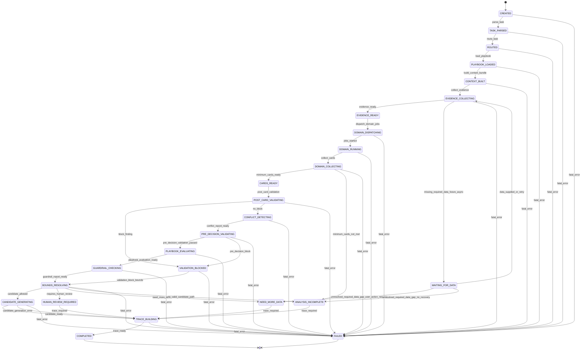
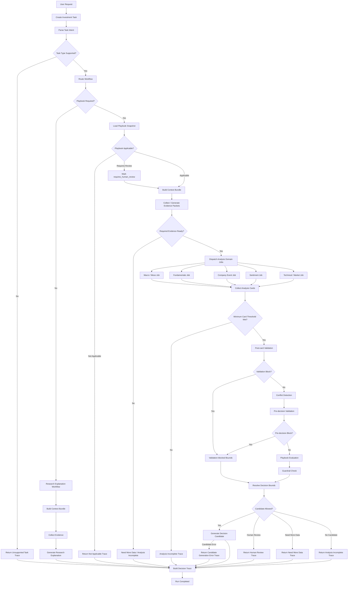

# SPEC-007：Orchestration 与执行路径

**版本：** v0.6  
**状态：** Approved  
**项目名称：** crosslens  
**依赖文档：** SPEC-001 v0.4；SPEC-003 v0.3.4；SPEC-004 v0.2.5；SPEC-006 v0.3.0  
**文档类型：** 工作流编排 / Orchestration Runtime Spec  
**目标阶段：** 产品机制设计 / MVP 执行架构定义

---

## 0. 版本说明

v0.6 合并以下版本内容：

1. SPEC-007 v0.5 Review；
    
2. SPEC-007 v0.5.1 Patch；
    
3. SPEC-007 v0.5.2 Patch。
    

本版本不引入新机制，仅完成 Approved 前的合并与一致性收口。

本版本完成以下内容：

1. 建立完整 Run State Machine；
    
2. 将 `RESOLVE_BOUNDS` 统一为 `BOUNDS_RESOLVING`；
    
3. 建立主执行流程；
    
4. 定义 Task Routing、Playbook Routing、Evidence Routing、Domain Dispatch；
    
5. 定义 Research Explanation Workflow；
    
6. 定义 Post-card Validation 与 Pre-decision Validation 双阶段；
    
7. 明确 Validation Block 必须先进入 `BOUNDS_RESOLVING` 并生成 bounds，再进入 Trace；
    
8. 区分 Post-card block 与 Pre-decision block；
    
9. 新增 `fix_analysis_inputs` 非 Candidate action；
    
10. 明确 Conflict Detection 与 SPEC-006 Conflict Handling 的职责边界；
    
11. 定义 Conflict Report 最小 schema；
    
12. 定义 `has_blocking_conflict` 产生逻辑；
    
13. 明确 Conflict Report schema error 进入 Validation，而不是 runtime crash；
    
14. 定义 Playbook Evaluation 最小接口契约；
    
15. 明确 execution-stage functions 只能消费 Playbook snapshot，不消费 mutable Playbook object；
    
16. 定义 Guardrail 与 Resolved Decision Bounds 的执行位置；
    
17. 明确 Guardrail 只能收窄 bounds，不能另开控制流；
    
18. 定义 RunFlags 与传播规则；
    
19. 定义 runtime_context 与上下文保留规则；
    
20. 定义 `requires_human_review` 汇聚规则；
    
21. 明确 `requires_human_review` 在 MVP 中阻止 Candidate 生成；
    
22. 明确 `requires_human_review` 不是 action；
    
23. 定义 Post-bounds Routing；
    
24. 定义 Candidate Generation Result；
    
25. 定义 `candidate_generation_error` 用户可见状态；
    
26. 定义 Workflow Node Schema；
    
27. 定义 Node Execution Result Schema；
    
28. 定义 Degradation Schema 与传播规则；
    
29. 定义 cumulative degradation upgrade；
    
30. 定义 Workflow Template Schema；
    
31. 定义 Run State Schema；
    
32. 定义 RunConfig Schema；
    
33. 定义 Event Log Schema；
    
34. 定义 WorkflowResult Schema；
    
35. 定义 ResearchExplanation Schema；
    
36. 定义 Trace 完成函数；
    
37. 定义 Failure Trace；
    
38. 定义 Recoverable Error 处理；
    
39. 定义 `decision_trace` ref-only 语义；
    
40. 明确 FAILED 状态下 failure trace 是 best-effort；
    
41. 明确域内冲突与跨域冲突边界；
    
42. 明确域内冲突对 Analysis Card `domain_status` 的影响；
    
43. 增加 `research_explanation` node_type；
    
44. 固化核心不变量；
    
45. 固化 MVP 实现边界。
    

---

## 1. 核心原则

### 1.1 Orchestration 原则

```text
State first.
Reports before evaluation.
Bounds before candidate.
Trace every degradation.
```

中文表达：

```text
状态优先；
先报告，后评估；
先边界，后候选；
所有降级都要进 Trace。
```

### 1.2 Runtime correctness 原则

```text
Errors precede failure transitions.
Human review must be aggregated into bounds.
Blocking conflict must be explicit.
Failure trace is best-effort, but terminal state is mandatory.
```

中文表达：

```text
错误事件先于失败迁移；
人工复核信号必须汇聚到边界；
阻断性冲突必须显式；
Failure trace 可以 best-effort，但终态必须合法。
```

### 1.3 实现安全原则

```text
Candidate errors complete with context, not silent failure.
Run flags must be explicit and propagated.
Schema errors become validation findings, not runtime crashes.
Research outputs must be traceable first-class objects.
```

中文表达：

```text
Candidate 错误应带上下文完成，而不是静默失败；
Run flags 必须显式并被传播；
Schema 错误应成为 Validation Finding，而不是运行时崩溃；
Research 输出必须是一等可追踪对象。
```

### 1.4 控制流收敛原则

```text
No bounds, no candidate routing.
Validation blocks always produce bounds before trace.
Recoverable errors become degradations with context.
Guardrails narrow bounds, not control flow.
```

中文表达：

```text
没有 bounds，就不能进入候选路由；
Validation block 在进入 Trace 前也必须先生成 bounds；
可恢复错误应带上下文转化为降级；
Guardrail 收窄边界，而不是另开控制流。
```

### 1.5 Approved 前原则

```text
Every declared helper must have routing semantics.
Every state transition must be reflected in pseudocode.
Every runtime object produced before an error must remain traceable.
Every bounds modification must be narrowing-only unless explicitly generated as validation-blocked bounds.
Execution consumes snapshots, never mutable Playbooks.
MVP stubs must be explicit.
Impossible state combinations must assert.
Candidate actions must come only from candidate-eligible actions.
```

中文表达：

```text
所有声明过的辅助函数都必须有路由语义；
所有状态迁移都必须体现在伪代码中；
错误发生前已经生成的 runtime object 必须仍然可追踪；
所有 bounds 修改默认只能收窄，除非显式生成 validation-blocked bounds；
执行阶段只消费 snapshot，不消费 mutable Playbook；
MVP stub 必须显式；
不可能的状态组合必须断言；
Candidate action 只能来自 candidate-eligible actions。
```

---

## 2. 文档目标

SPEC-007 定义 crosslens 如何把一次 Investment Task 执行为一个有状态、可观测、可恢复、可审计的编排图。

SPEC-003 定义总体对象链。  
SPEC-004 定义能力域 Analysis Card 输出。  
SPEC-006 定义 Playbook 如何消费 Analysis Card、`constraint_exports`、Conflict Report，并生成 Playbook Evaluation Report。

SPEC-007 进一步回答：

1. 一次投研任务如何进入运行状态；
    
2. Orchestrator 如何判断下一步执行什么；
    
3. 哪些节点串行，哪些节点并行；
    
4. 什么情况下跳过、降级、重试或终止；
    
5. Analysis Domain Jobs 如何被派发；
    
6. Validation、Conflict、Playbook、Guardrail 的执行顺序如何固定；
    
7. `run_status` 如何变化；
    
8. Event Log 如何记录；
    
9. 何时生成 Decision Candidate；
    
10. 何时只返回 `analysis_incomplete`、`need_more_data`、`requires_human_review`；
    
11. 哪些对象构成 Runtime 层的输入输出契约；
    
12. 如何在失败、降级、候选生成错误时保留审计上下文。
    

一句话：

```text
SPEC-007 defines how crosslens executes an investment workflow as a stateful, observable, recoverable orchestration graph.
```

---

## 3. Orchestration 的定位

Orchestrator 不是 Agent 群聊主持人。

它是：

1. 状态机；
    
2. 工作流调度器；
    
3. 节点执行器；
    
4. 失败与降级处理器；
    
5. Event Log 写入器；
    
6. Trace 构建协调器；
    
7. Decision Bounds 前置守门人。
    

能力域内部可以使用 Agentic 能力，但 Orchestration 层必须 deterministic-first。

Orchestrator 不负责投资判断本身。它负责保证：

1. 输入对象明确；
    
2. 执行顺序明确；
    
3. 节点结果结构化；
    
4. 降级可追踪；
    
5. Bounds 先于 Candidate；
    
6. Candidate 不越界；
    
7. Trace 可审计；
    
8. runtime error 不丢失已生成上下文。
    

---

## 4. Run State Machine

### 4.1 状态图



### 4.2 状态语义

|run_status|语义|
|---|---|
|`CREATED`|Run 已创建，但尚未解析任务|
|`TASK_PARSED`|用户任务已解析为 Investment Task|
|`ROUTED`|已确定工作流类型与初始路径|
|`PLAYBOOK_LOADED`|已加载 Playbook snapshot|
|`CONTEXT_BUILT`|已生成 Context Bundle|
|`EVIDENCE_COLLECTING`|正在收集或生成 Evidence Packets|
|`WAITING_FOR_DATA`|未来异步 / resume 模式保留状态|
|`EVIDENCE_READY`|Evidence Packets 达到最低可用要求|
|`DOMAIN_DISPATCHING`|正在派发 Analysis Domain Jobs|
|`DOMAIN_RUNNING`|能力域任务执行中|
|`DOMAIN_COLLECTING`|正在收集 Analysis Cards|
|`CARDS_READY`|Analysis Cards 达到最低可用阈值|
|`POST_CARD_VALIDATING`|正在执行 Post-card Validation|
|`VALIDATION_BLOCKED`|已发现 Block Validation Finding，正在准备 validation-blocked bounds|
|`CONFLICT_DETECTING`|正在执行跨域冲突检测|
|`PRE_DECISION_VALIDATING`|正在执行决策前验证|
|`PLAYBOOK_EVALUATING`|正在执行 Playbook Evaluation|
|`GUARDRAIL_CHECKING`|正在执行 Guardrail 检查|
|`BOUNDS_RESOLVING`|正在生成 Resolved Decision Bounds|
|`CANDIDATE_GENERATING`|正在生成 Decision Candidate|
|`HUMAN_REVIEW_REQUIRED`|需要人工复核|
|`NEED_MORE_DATA`|需要补充数据|
|`ANALYSIS_INCOMPLETE`|分析不完整，无法生成完整 Decision Candidate|
|`TRACE_BUILDING`|正在生成 Decision Trace|
|`COMPLETED`|Run 完成|
|`FAILED`|Run 因不可恢复错误失败|

### 4.3 `WAITING_FOR_DATA` MVP 语义

MVP 阶段不支持长时间交互式等待。

```text
WAITING_FOR_DATA 是未来异步 / resume 模式保留状态；
MVP 同步执行路径中，required data 缺失直接进入 NEED_MORE_DATA 或 ANALYSIS_INCOMPLETE。
```

状态机保留 `WAITING_FOR_DATA`，但主流程图不在此暂停。

### 4.4 `VALIDATION_BLOCKED` 语义

`VALIDATION_BLOCKED` 表示系统已发现 Block 级 Validation Finding。

它不是终止状态。

Orchestrator 仍必须：

1. 进入 `BOUNDS_RESOLVING`；
    
2. 生成 validation-blocked Resolved Decision Bounds；
    
3. 保留此前已经设置的 RunFlags；
    
4. 进入 Decision Trace；
    
5. 向用户解释为何不能生成 Decision Candidate。
    

### 4.5 fatal error 出口不变量

```text
任何会执行代码、读写对象或生成结构化输出的非 terminal 状态，都必须具备 fatal_error → FAILED 出口。
例外：FAILED 后的 failure trace 构建是 best-effort，不触发新的状态迁移。
```

---

## 5. 主执行流程图



---

## 6. 顶层路由伪代码

### 6.1 `run_investment_workflow`

```python
def run_investment_workflow(user_request, run_config):
    run = create_run(user_request, run_config)
    log_event(run, "RUN_CREATED")

    try:
        task = parse_investment_task(user_request)
        run.task_id = task.task_id
        run.runtime_context.task = task
        set_status(run, "TASK_PARSED")
        log_event(run, "TASK_PARSED", task=task)

        route = route_task(task, run_config)
        set_status(run, "ROUTED")
        log_event(run, "TASK_ROUTED", route=route)

        if route.route_status == "unsupported":
            return complete_with_trace(
                run=run,
                terminal_status="COMPLETED",
                user_visible_status="unsupported_task",
                user_visible_reason=route.reason,
                reason=route.reason,
                task=task
            )

        if route.required_playbook is False:
            return run_research_explanation_workflow(
                run=run,
                task=task,
                run_config=run_config
            )

        playbook_result = load_and_check_playbook(task, route, run_config)
        log_event(run, "PLAYBOOK_LOADED", playbook=playbook_result.snapshot_ref)

        if playbook_result.applicability_status == "not_applicable":
            return complete_with_trace(
                run=run,
                terminal_status="COMPLETED",
                user_visible_status="not_applicable",
                user_visible_reason=playbook_result.reason,
                reason=playbook_result.reason,
                task=task
            )

        playbook_snapshot = load_snapshot(playbook_result.snapshot_ref)

        if playbook_result.applicability_status == "requires_human_review":
            run.flags.requires_human_review = True
            log_event(
                run,
                "PLAYBOOK_REQUIRES_HUMAN_REVIEW",
                reason=playbook_result.reason,
                reasoning_source=playbook_result.reasoning_source
            )

        context = build_context_bundle(
            task=task,
            playbook=playbook_snapshot,
            run_config=run_config
        )
        run.runtime_context.context_bundle = context
        set_status(run, "CONTEXT_BUILT")
        log_event(run, "CONTEXT_BUNDLE_BUILT", context=context.ref)

        evidence_result = collect_or_generate_evidence(
            run=run,
            task=task,
            context=context,
            playbook=playbook_snapshot,
            run_config=run_config
        )

        if evidence_result.status == "missing_required_data":
            run.flags.need_more_data = True
            return complete_with_trace(
                run=run,
                terminal_status="COMPLETED",
                user_visible_status="need_more_data",
                user_visible_reason=evidence_result.reason,
                reason=evidence_result.reason,
                task=task,
                evidence_gaps=evidence_result.gaps
            )

        set_status(run, "EVIDENCE_READY")
        log_event(run, "EVIDENCE_READY", evidence_refs=evidence_result.refs)

        domain_plan = plan_domain_jobs(
            task=task,
            context=context,
            evidence=evidence_result,
            playbook=playbook_snapshot,
            run_config=run_config
        )

        cards = dispatch_and_collect_domain_jobs(domain_plan, run)

        apply_cumulative_degradation_rules(
            run=run,
            degradations=run.runtime_context.accumulated_degradations
        )

        run.runtime_context.cards = cards.cards

        set_status(run, "CARDS_READY" if cards.minimum_threshold_met else "ANALYSIS_INCOMPLETE")

        if not cards.minimum_threshold_met:
            run.flags.analysis_incomplete = True
            return complete_with_trace(
                run=run,
                terminal_status="COMPLETED",
                user_visible_status="analysis_incomplete",
                user_visible_reason="minimum_cards_not_met",
                reason=cards.threshold_failure_reason,
                task=task,
                cards=cards.partial_cards
            )

        post_card_validation = run_post_card_validation(
            task=task,
            cards=cards,
            evidence=evidence_result,
            context=context,
            playbook=playbook_snapshot,
            run_config=run_config
        )

        run.runtime_context.validation_reports.append(post_card_validation)

        if post_card_validation.has_block:
            run.flags.analysis_incomplete = True

            set_status(run, "VALIDATION_BLOCKED")
            log_event(
                run,
                "VALIDATION_BLOCK_DETECTED",
                block_source="post_card",
                validation_report_id=post_card_validation.validation_report_id
            )

            set_status(run, "BOUNDS_RESOLVING")

            bounds = create_validation_blocked_bounds(
                task=task,
                validation_report=post_card_validation,
                block_source="post_card",
                run_flags=run.flags
            )

            run.runtime_context.bounds = bounds

            return finalize_without_candidate(
                run=run,
                task=task,
                bounds=bounds,
                user_visible_status=route_validation_block_user_status(bounds),
                user_visible_reason=route_validation_block_user_reason(
                    block_source="post_card",
                    validation_report=post_card_validation,
                    bounds=bounds
                ),
                reason="post_card_validation_block",
                cards=cards.cards,
                validation_reports=[post_card_validation]
            )

        conflicts = detect_conflicts(
            task=task,
            cards=cards,
            context=context,
            playbook=playbook_snapshot,
            run_config=run_config
        )

        run.runtime_context.conflict_report = conflicts

        pre_decision_validation = run_pre_decision_validation(
            task=task,
            cards=cards,
            post_card_validation=post_card_validation,
            conflict_report=conflicts,
            playbook=playbook_snapshot,
            run_config=run_config
        )

        run.runtime_context.validation_reports.append(pre_decision_validation)

        if pre_decision_validation.has_block:
            run.flags.analysis_incomplete = True

            set_status(run, "VALIDATION_BLOCKED")
            log_event(
                run,
                "VALIDATION_BLOCK_DETECTED",
                block_source="pre_decision",
                validation_report_id=pre_decision_validation.validation_report_id
            )

            set_status(run, "BOUNDS_RESOLVING")

            bounds = create_validation_blocked_bounds(
                task=task,
                validation_report=pre_decision_validation,
                block_source="pre_decision",
                run_flags=run.flags
            )

            run.runtime_context.bounds = bounds

            return finalize_without_candidate(
                run=run,
                task=task,
                bounds=bounds,
                user_visible_status=route_validation_block_user_status(bounds),
                user_visible_reason=route_validation_block_user_reason(
                    block_source="pre_decision",
                    validation_report=pre_decision_validation,
                    bounds=bounds
                ),
                reason="pre_decision_validation_block",
                cards=cards.cards,
                validation_reports=[post_card_validation, pre_decision_validation],
                conflict_report=conflicts
            )

        playbook_eval = evaluate_playbook(
            task=task,
            playbook=playbook_snapshot,
            cards=cards.cards,
            conflict_report=conflicts,
            run_config=run_config
        )

        run.runtime_context.playbook_evaluation_report = playbook_eval

        apply_cumulative_degradation_rules(
            run=run,
            degradations=run.runtime_context.accumulated_degradations
        )

        guardrail_report = run_guardrail_check(
            task=task,
            cards=cards,
            playbook_eval=playbook_eval,
            run_config=run_config
        )

        run.runtime_context.guardrail_report = guardrail_report

        apply_cumulative_degradation_rules(
            run=run,
            degradations=run.runtime_context.accumulated_degradations
        )

        set_status(run, "BOUNDS_RESOLVING")

        bounds = resolve_decision_bounds(
            task=task,
            validation_reports=[post_card_validation, pre_decision_validation],
            conflict_report=conflicts,
            playbook_eval=playbook_eval,
            guardrail_report=guardrail_report,
            run_flags=run.flags
        )

        if bounds is None:
            raise FatalWorkflowError("resolved_decision_bounds_missing")

        run.runtime_context.bounds = bounds

        return route_after_bounds(
            run=run,
            task=task,
            cards=cards,
            bounds=bounds,
            playbook_eval=playbook_eval,
            validation_reports=[post_card_validation, pre_decision_validation],
            conflict_report=conflicts,
            guardrail_report=guardrail_report
        )

    except RecoverableWorkflowError as err:
        return handle_recoverable_error(run, err)

    except Exception as err:
        return build_failure_trace(run, err)
```

---

## 7. Task Routing

### 7.1 intent 与 task_type 的关系

|字段|语义|
|---|---|
|`intent`|用户意图的语义分类|
|`task_type`|系统可执行任务类型|

Tie-breaking 规则：

1. `intent = explain | education | general_research` 优先路由到 research workflow；
    
2. decision intent 必须匹配 supported decision task_type；
    
3. 若 `intent` 与 `task_type` 不一致，返回 `unsupported_task`，reason = `intent_task_type_mismatch`；
    
4. 不允许仅凭 intent 绕过 task_type 检查进入 decision workflow。
    

### 7.2 `route_task`

```python
SUPPORTED_ASSET_TYPES = {"stock"}

SUPPORTED_DECISION_TASK_TYPES = {
    "single_stock_buy_decision",
    "single_stock_hold_review",
    "single_stock_watchlist_review"
}

def route_task(task, run_config):
    if task.asset_type not in SUPPORTED_ASSET_TYPES:
        return RouteResult(
            route_status="unsupported",
            reason="unsupported_asset_type"
        )

    if task.intent in ["explain", "education", "general_research"]:
        return RouteResult(
            route_status="supported",
            workflow_type="research_explanation_workflow",
            decision_candidate_allowed=False,
            required_playbook=False
        )

    if task.intent in ["buy_decision", "hold_review", "watchlist_review"]:
        if task.task_type not in SUPPORTED_DECISION_TASK_TYPES:
            return RouteResult(
                route_status="unsupported",
                reason="intent_task_type_mismatch"
            )

        return RouteResult(
            route_status="supported",
            workflow_type="single_stock_standard_analysis_workflow",
            decision_candidate_allowed=True,
            required_playbook=True
        )

    if task.intent in ["portfolio_review", "position_sizing", "tax_optimization"]:
        return RouteResult(
            route_status="unsupported",
            reason="out_of_scope_for_mvp"
        )

    return RouteResult(
        route_status="unsupported",
        reason="unknown_intent"
    )
```

---

## 8. Research Explanation Workflow

### 8.1 定位

`research_explanation_workflow` 用于解释性、教育性、一般研究类任务。

它不生成 Decision Candidate。

它跳过：

1. Playbook Evaluation；
    
2. Resolved Decision Bounds；
    
3. Decision Candidate generation；
    
4. Domain Dispatch。
    

输出不是投资建议，而是 Research Explanation Trace。

### 8.2 执行路径

```text
Parse Task
→ Route Workflow
→ Build Context Bundle
→ Collect Evidence
→ Generate Research Explanation
→ Build Trace
→ Completed
```

### 8.3 ResearchExplanation Schema

```json
{
  "research_explanation_id": "rex_001",
  "task_id": "task_002",
  "run_id": "run_002",
  "summary": "This is an explanatory research response.",
  "sections": [
    {
      "section_id": "sec_001",
      "title": "Background",
      "content": "..."
    }
  ],
  "source_refs": [
    "evidence_packet://ev_001"
  ],
  "limitations": [],
  "created_at": "2026-06-14T10:00:00Z"
}
```

### 8.4 伪代码

```python
def run_research_explanation_workflow(run, task, run_config):
    context = build_context_bundle(
        task=task,
        playbook=None,
        run_config=run_config
    )
    run.runtime_context.context_bundle = context

    set_status(run, "CONTEXT_BUILT")
    log_event(run, "CONTEXT_BUNDLE_BUILT", context=context.ref)

    set_status(run, "EVIDENCE_COLLECTING")
    evidence = collect_or_generate_evidence(
        run=run,
        task=task,
        context=context,
        playbook=None,
        run_config=run_config
    )

    if evidence.status == "missing_required_data":
        run.flags.need_more_data = True
        return complete_with_trace(
            run=run,
            terminal_status="COMPLETED",
            user_visible_status="need_more_data",
            user_visible_reason=evidence.reason,
            task=task,
            evidence_gaps=evidence.gaps,
            reason=evidence.reason
        )

    set_status(run, "EVIDENCE_READY")
    log_event(run, "EVIDENCE_READY", evidence_refs=evidence.refs)

    explanation = generate_research_explanation(
        task=task,
        context=context,
        evidence=evidence
    )

    run.runtime_context.research_explanation = explanation

    return complete_with_trace(
        run=run,
        terminal_status="COMPLETED",
        user_visible_status="research_explanation_ready",
        user_visible_reason="research_explanation_ready",
        task=task,
        explanation=explanation,
        evidence_gaps=evidence.gaps,
        candidate=None,
        cards=[]
    )
```

### 8.5 异常处理

`run_research_explanation_workflow` 不在函数内部单独捕获 `generate_research_explanation` 异常。

其异常由顶层 `run_investment_workflow` 中的：

```python
except RecoverableWorkflowError
except Exception
```

统一捕获。

### 8.6 research workflow 与 Domain Dispatch 的关系

`research_explanation_workflow` 不进入 Domain Dispatch。

`get_domain_requirement(playbook=None)` 返回 `None` 是防御性定义。

它不是 research workflow 的域执行机制。

未来若 research workflow 需要能力域执行，应定义独立：

```text
research_analysis_workflow
```

或在 Workflow Template 中显式声明 research-specific domain nodes。

---

## 9. Playbook Routing

### 9.1 `PlaybookLoadResult`

```json
{
  "playbook": {
    "playbook_id": "capital_cycle_fundamental_playbook",
    "usage": "internal_transition_only"
  },
  "snapshot_ref": "playbook_snapshot://pbs_001",
  "applicability_status": "applicable",
  "reason": null,
  "reasoning_source": null
}
```

`playbook` 是内部过渡对象。  
`snapshot_ref` 是后续执行阶段唯一合法输入。

### 9.2 `load_and_check_playbook`

```python
def load_and_check_playbook(task, route, run_config):
    if not route.required_playbook:
        return PlaybookLoadResult(
            playbook=None,
            applicability_status="not_required"
        )

    playbook = resolve_playbook(
        requested_playbook_id=task.playbook_id,
        default_playbook_id=run_config.default_playbook_id
    )

    if playbook is None:
        return PlaybookLoadResult(
            applicability_status="not_applicable",
            reason="playbook_not_found"
        )

    if playbook.status != "active" and not run_config.allow_non_active_playbook:
        return PlaybookLoadResult(
            applicability_status="not_applicable",
            reason="playbook_not_active"
        )

    if task.asset_type not in playbook.applicability.asset_types:
        return PlaybookLoadResult(
            playbook=playbook,
            applicability_status="not_applicable",
            reason="asset_type_not_supported_by_playbook"
        )

    if task.task_type not in playbook.applicability.supported_task_types:
        return PlaybookLoadResult(
            playbook=playbook,
            applicability_status="not_applicable",
            reason="task_type_not_supported_by_playbook"
        )

    snapshot_ref = create_playbook_snapshot(playbook)

    if is_time_horizon_mismatch(task, playbook):
        return PlaybookLoadResult(
            playbook=playbook,
            snapshot_ref=snapshot_ref,
            applicability_status="requires_human_review",
            reason="time_horizon_mismatch",
            reasoning_source="playbook_applicability"
        )

    return PlaybookLoadResult(
        playbook=playbook,
        applicability_status="applicable",
        snapshot_ref=snapshot_ref
    )
```

### 9.3 Snapshot 不变量

```text
Playbook snapshot is the execution input.
Mutable Playbook object must not be used after snapshot creation.
After Playbook snapshot creation, every execution-stage function must consume playbook_snapshot, not the mutable Playbook object.
```

中文表达：

```text
Playbook snapshot 是执行输入；
snapshot 创建后，不得继续消费 mutable Playbook object；
Playbook snapshot 创建后，所有执行阶段函数都必须消费 playbook_snapshot。
```

---

## 10. `time_horizon_mismatch` 双路径

`time_horizon_mismatch` 可能来自两条路径：

1. Playbook Applicability；
    
2. Conflict Detection / Conflict Handling。
    

### 10.1 Applicability 路径

如果 Task 的目标周期与 Playbook Applicability 明显不匹配：

```python
return PlaybookLoadResult(
    playbook=playbook,
    applicability_status="requires_human_review",
    reason="time_horizon_mismatch",
    reasoning_source="playbook_applicability"
)
```

此路径发生在 Playbook 加载阶段。

### 10.2 Conflict Detection 路径

如果 Playbook 本身适用，但某些 Analysis Card 的 `time_horizon` 与任务周期或 Playbook 周期不一致：

```json
{
  "conflict_type": "time_horizon_mismatch",
  "severity": "low",
  "reasoning_source": "conflict_detection",
  "source_card_refs": ["card_technical_001"]
}
```

此路径发生在 Analysis Cards 收集后。

### 10.3 合并规则

两条路径都必须进入 Decision Trace。

如果 Applicability 路径已经触发 `requires_human_review`，Conflict Detection 中的 `time_horizon_mismatch` 不应覆盖该结果，只能补充说明。

Conflict Detection 不需要跳过 `time_horizon_mismatch` 检测。

但 Decision Trace 展示时必须合并重复项。

若同一 Run 中存在多个 `time_horizon_mismatch`，Trace 应按 source 聚合：

```text
time_horizon_mismatch detected in multiple stages:
- playbook_applicability
- conflict_detection
```

Later `time_horizon_mismatch` findings must not overwrite earlier `playbook_applicability` findings.

去重属于 SPEC-008 Trace 展示层的格式化职责。SPEC-007 只要求保留所有 source，不要求在 Runtime 层合并对象。

---

## 11. Evidence Routing

### 11.1 `playbook = None` 的输入派生

```python
def derive_required_inputs_from_playbook(playbook, task):
    if playbook is None:
        return derive_default_research_inputs(task)

    return derive_constraint_inputs_from_playbook(playbook, task)
```

### 11.2 Research 默认输入

Research workflow 的默认输入不是 hard requirement。

```python
def derive_default_research_inputs(task):
    return RequiredInputSet(
        required_for_hard_constraint=[],
        preferred_research_inputs=[
            "company_profile",
            "recent_price_context",
            "recent_news_context"
        ],
        optional_inputs=[
            "financial_snapshot",
            "technical_snapshot",
            "sentiment_snapshot"
        ]
    )
```

### 11.3 Research 最小 evidence 规则

```text
preferred_research_inputs 全部缺失不必然阻断；
只有完全没有可用 evidence/context 时，才返回 need_more_data。
```

### 11.4 `satisfies_minimum_evidence_requirements`

```python
def satisfies_minimum_evidence_requirements(evidence_packets, playbook):
    if playbook is None:
        return satisfies_research_minimum_evidence(evidence_packets)

    return satisfies_playbook_minimum_evidence(evidence_packets, playbook)
```

### 11.5 Evidence gaps 收集策略

MVP 收集所有 hard-required evidence gaps 后统一返回。

```python
def collect_or_generate_evidence(run, task, context, playbook, run_config):
    required_inputs = derive_required_inputs_from_playbook(
        playbook=playbook,
        task=task
    )

    evidence_plan = build_evidence_plan(
        task=task,
        context=context,
        required_inputs=required_inputs,
        run_config=run_config
    )

    evidence_packets = []
    hard_gaps = []

    for source in evidence_plan.sources:
        result = collect_evidence_from_source(source)

        if result.status == "success":
            evidence_packets.extend(result.evidence_packets)
            continue

        if result.status == "stale":
            if source.required_for_hard_constraint:
                hard_gaps.append({
                    "input_ref": source.required_input_ref,
                    "reason": "required_hard_constraint_data_stale"
                })
                log_event(
                    run,
                    "REQUIRED_EVIDENCE_STALE",
                    input_ref=source.required_input_ref
                )
                continue

            log_event(
                run,
                "OPTIONAL_EVIDENCE_STALE",
                input_ref=source.required_input_ref,
                source=source.source_id
            )
            continue

        if result.status == "missing":
            if source.required_for_hard_constraint:
                hard_gaps.append({
                    "input_ref": source.required_input_ref,
                    "reason": "required_hard_constraint_data_missing"
                })
                log_event(
                    run,
                    "REQUIRED_EVIDENCE_MISSING",
                    input_ref=source.required_input_ref
                )
                continue

            log_event(
                run,
                "OPTIONAL_EVIDENCE_MISSING",
                input_ref=source.required_input_ref,
                source=source.source_id
            )
            continue

        log_event(
            run,
            "OPTIONAL_EVIDENCE_ERROR",
            input_ref=source.required_input_ref,
            source=source.source_id,
            status=result.status
        )

    if hard_gaps:
        run.flags.need_more_data = True
        run.runtime_context.evidence_gaps = hard_gaps
        return EvidenceResult(
            status="missing_required_data",
            reason="required_hard_constraint_evidence_gaps",
            gaps=hard_gaps
        )

    if not satisfies_minimum_evidence_requirements(evidence_packets, playbook):
        gaps = find_evidence_gaps(required_inputs, evidence_packets)
        run.flags.need_more_data = True
        run.runtime_context.evidence_gaps = gaps
        return EvidenceResult(
            status="missing_required_data",
            reason="minimum_evidence_not_satisfied",
            gaps=gaps
        )

    return EvidenceResult(
        status="ready",
        refs=[packet.evidence_ref for packet in evidence_packets],
        evidence_packets=evidence_packets
    )
```

---

## 12. Domain Job Dispatch

### 12.1 `get_domain_requirement`

```python
def get_domain_requirement(playbook, domain):
    if playbook is None:
        return None

    return resolve_domain_requirement_from_playbook(playbook, domain)
```

### 12.2 `plan_domain_jobs`

`plan_domain_jobs` 只允许用于 Playbook-driven workflow。

```python
def plan_domain_jobs(task, context, evidence, playbook, run_config):
    assert playbook is not None, (
        "plan_domain_jobs requires a non-null playbook; "
        "use research_explanation_workflow for non-playbook runs."
    )

    jobs = []

    for domain in ALL_ANALYSIS_DOMAINS:
        domain_requirement = get_domain_requirement(playbook, domain)

        if domain_requirement is None:
            continue

        if should_skip_domain(domain, task, context, run_config):
            jobs.append(DomainJob(
                domain=domain,
                status="skipped",
                skip_reason="not_relevant_or_disabled"
            ))
            continue

        job_inputs = build_domain_job_inputs(
            domain=domain,
            task=task,
            context=context,
            evidence=evidence,
            playbook_constraints=filter_constraints_for_domain(playbook, domain)
        )

        jobs.append(DomainJob(
            domain=domain,
            status="planned",
            inputs=job_inputs,
            minimum_status=domain_requirement.minimum_status,
            on_missing=domain_requirement.on_missing
        ))

    return DomainPlan(jobs=jobs)
```

不变量：

```text
Domain Dispatch is only valid for Playbook-driven workflows.
```

### 12.3 Parallel dispatch semantics

MVP 默认采用：

```text
dispatch_all_then_collect_until_timeout
```

语义：

1. Orchestrator 一次性派发所有 planned domain jobs；
    
2. 每个 job 有独立 timeout；
    
3. Orchestrator 等待所有 job 返回，或等待全局 domain phase timeout；
    
4. `collect_next_completed_job()` 可采用阻塞式 poll；
    
5. 成功 job 生成 Analysis Card；
    
6. 失败 / 超时 job 生成 failure card；
    
7. 不因单个 optional domain 超时中断全局流程；
    
8. Fundamentals 超时或失败通常导致 minimum card threshold 失败或 pre-decision validation block。
    

```python
def dispatch_and_collect_domain_jobs(domain_plan, run):
    planned_jobs = [
        job for job in domain_plan.jobs
        if job.status == "planned"
    ]

    dispatch_parallel(planned_jobs)
    set_status(run, "DOMAIN_RUNNING")
    log_event(run, "DOMAIN_JOBS_STARTED", jobs=planned_jobs)

    deadline = now() + run.run_config.domain_phase_timeout_ms

    while now() < deadline and not all_jobs_terminal(planned_jobs):
        result = collect_next_completed_job()
        handle_domain_job_result(result, run)

    for job in unfinished_jobs(planned_jobs):
        mark_timeout(job)
        create_domain_failure_card(job, reason="domain_phase_timeout")
        log_event(run, "DOMAIN_CARD_FALLBACK", domain=job.domain, reason="timeout")

    cards = collect_all_cards_from_jobs(planned_jobs)
    threshold = evaluate_minimum_card_threshold(cards)

    return CardCollectionResult(
        cards=cards,
        minimum_threshold_met=threshold.met,
        threshold_failure_reason=threshold.reason
    )
```

---

## 13. Retry Policy Stub

SPEC-007 v0.6 不定义完整 Retry Policy。

```python
def maybe_retry_domain_job(job, run):
    """
    Retry policy will be defined in a future SPEC-007 revision.

    MVP behavior:
    - no automatic retry;
    - return original failure result;
    - Orchestrator may create a failure card if allowed by domain policy.
    """
    log_event(
        run,
        "DOMAIN_JOB_RETRY_SKIPPED",
        domain=job.domain,
        reason="retry_policy_not_enabled_in_mvp"
    )

    return job.last_result
```

MVP 不允许实现者自行添加隐式 retry。

所有 retry 行为必须进入 Event Log。

---

## 14. Validation 双阶段定义

### 14.1 Post-card Validation

Post-card Validation 在 Analysis Cards 收集后立即执行。

输入：

1. Analysis Cards；
    
2. Evidence Packets；
    
3. Context Bundle；
    
4. Run Config；
    
5. Playbook snapshot。
    

检查对象：

1. Analysis Card schema 是否完整；
    
2. `domain_status` 与 `stance` 是否合法对应；
    
3. `constraint_exports` 是否可解析；
    
4. `constraint_exports` 的 `data_freshness` 是否满足 SPEC-004 要求；
    
5. Hard Constraint candidate exports 是否满足 `can_support_hard_constraint = true`；
    
6. event-level label 是否误用于 hard export；
    
7. Analysis Card 的 evidence refs 是否存在；
    
8. `time_horizon` 字段是否完整。
    

`data_freshness` 检查继承 SPEC-004 v0.2.5 中 Analysis Card `data_freshness` 与 `constraint_exports` 的字段约束。SPEC-007 不重新定义 freshness 阈值，只检查字段是否存在、格式是否可解析、hard-capable export 是否缺失 freshness、stale 标记是否能进入 Constraint / Decision Trace。

输出：

```json
{
  "validation_report_id": "pcv_001",
  "validation_stage": "post_card",
  "task_id": "task_001",
  "run_id": "run_001",
  "primary_reason": "hard_export_missing_freshness",
  "findings": [],
  "has_block": false,
  "has_warning": true,
  "requires_human_review": false
}
```

Block 示例：

```text
required Analysis Card schema missing
hard constraint export lacks data_freshness
hard constraint export backed only by interpreted evidence
missing required evidence_ref
```

### 14.2 Pre-decision Validation

Pre-decision Validation 在 Conflict Detection 之后、Playbook Evaluation 之前执行。

输入：

1. Analysis Cards；
    
2. Post-card Validation Report；
    
3. Conflict Report；
    
4. Playbook snapshot；
    
5. Run Config。
    

检查对象：

1. 最小可用能力域阈值是否仍满足；
    
2. Playbook required input_refs 是否可以被解析；
    
3. Playbook Hard Constraint 所需 exports 是否存在；
    
4. required domains 是否满足 minimum_status；
    
5. Conflict Report 是否包含 Block 级冲突；
    
6. Conflict Report 是否存在 schema_errors；
    
7. 是否存在 Playbook / task time horizon 不可调和错配；
    
8. 是否存在 Candidate 前必须人工复核的条件。
    

输出：

```json
{
  "validation_report_id": "pdv_001",
  "validation_stage": "pre_decision",
  "task_id": "task_001",
  "run_id": "run_001",
  "primary_reason": null,
  "findings": [],
  "has_block": false,
  "requires_human_review": false
}
```

Block 示例：

```text
Fundamentals missing or failed
no valid hard constraint inputs
minimum card threshold not met
playbook required input_refs unresolved
blocking conflict detected
invalid conflict report schema
```

Human Review 示例：

```text
time_horizon_mismatch
high_conflict
macro regime uncertainty
```

### 14.3 两者区别

|项目|Post-card Validation|Pre-decision Validation|
|---|---|---|
|执行位置|Cards 收集后|Conflict Detection 后|
|主要对象|Analysis Card / Evidence / Export|Candidate 前条件|
|主要目标|检查卡片与证据是否可用|检查是否可进入 Playbook Evaluation|
|是否理解 Playbook|只检查 export 可用性|检查 Playbook required inputs|
|Block 结果|validation-blocked bounds|validation-blocked bounds|
|block_source|`post_card`|`pre_decision`|

---

## 15. Validation Block 与 validation-blocked bounds

### 15.1 block_source

所有 validation-blocked 路径必须携带：

```text
block_source = post_card | pre_decision
```

### 15.2 状态路径

Validation block 路径必须严格经过：

```text
POST_CARD_VALIDATING / PRE_DECISION_VALIDATING
→ VALIDATION_BLOCKED
→ BOUNDS_RESOLVING
→ TRACE_BUILDING
→ COMPLETED
```

`create_validation_blocked_bounds` 属于 bounds generation，因此必须在 `BOUNDS_RESOLVING` 状态下执行。

### 15.3 Post-card block Trace

Post-card block 的 Trace 必须说明：

1. 哪个 Analysis Card / Export / Evidence ref 不可信；
    
2. 为什么后续 Conflict Detection / Playbook Evaluation 被跳过；
    
3. 用户应补充什么数据或修复什么输入；
    
4. 是否同时存在 `requires_human_review` flag。
    

用户可见语义：

```text
本次分析未形成可审计输入，无法继续执行 Playbook Evaluation。
```

### 15.4 Pre-decision block Trace

Pre-decision block 的 Trace 必须说明：

1. Cards 已经生成；
    
2. 哪个 Candidate 前置条件失败；
    
3. 是否为 `has_blocking_conflict`；
    
4. 是否可通过补充数据、人工复核或换 Playbook 继续。
    

用户可见语义：

```text
本次分析已有结构化结果，但不满足自动生成 Candidate 的前置条件。
```

### 15.5 新增非 Candidate action：`fix_analysis_inputs`

MVP `allowed_actions` 增加非 Candidate action：

```text
fix_analysis_inputs
```

语义：

```text
修复输入、schema、evidence lineage 或 capability 输出后重新运行。
```

`fix_analysis_inputs` 不得作为 `DecisionCandidate.suggested_action`。

### 15.6 `derive_validation_blocked_allowed_actions`

```python
def derive_validation_blocked_allowed_actions(block_source, validation_report):
    if validation_report.primary_reason in {
        "required_data_missing",
        "required_data_stale",
        "constraint_input_missing"
    }:
        return ["need_more_data"]

    if validation_report.primary_reason in {
        "schema_invalid",
        "hard_export_missing_freshness",
        "hard_export_backed_by_interpreted_evidence",
        "missing_evidence_ref",
        "invalid_conflict_report_schema"
    }:
        return ["fix_analysis_inputs"]

    return ["fix_analysis_inputs"]
```

### 15.7 `create_validation_blocked_bounds`

```python
def create_validation_blocked_bounds(
    task,
    validation_report,
    block_source,
    run_flags,
    existing_context_refs=None
):
    allowed_actions = derive_validation_blocked_allowed_actions(
        block_source=block_source,
        validation_report=validation_report
    )

    bounds = ResolvedDecisionBounds(
        task_id=task.task_id,
        run_id=task.run_id,
        allowed_actions=allowed_actions,
        blocked_actions=[
            "buy",
            "hold",
            "wait",
            "avoid",
            "reduce",
            "add_to_watchlist",
            "hold_if_already_owned"
        ],
        requires_human_review=(
            validation_report.requires_human_review is True
            or run_flags.requires_human_review is True
        ),
        analysis_incomplete=True,
        confidence_cap=0.0,
        confidence_cap_reason="validation_block",
        source_refs=[validation_report.validation_report_id],
        applied_rules=["validation_blocked_bounds"],
        reasoning=[
            {
                "reasoning_type": "validation_block",
                "block_source": block_source,
                "message": "Validation block prevents candidate generation."
            }
        ]
    )

    return bounds
```

### 15.8 不变量

```text
Validation-blocked bounds must preserve run_flags.requires_human_review.
Validation block must enter BOUNDS_RESOLVING before Trace.
Validation-blocked bounds are still ResolvedDecisionBounds.
```

---

## 16. Conflict Detection 与 Conflict Handling 分工

### 16.1 两者不是同一件事

SPEC-007 的 `detect_conflicts` 负责发现跨域冲突。

SPEC-006 的 Conflict Handling 负责解释这些冲突对 Playbook Evaluation 的影响。

```text
SPEC-007 Conflict Detection:
Analysis Cards → Conflict Report

SPEC-006 Conflict Handling:
Conflict Report + Playbook rules → actions / ranking / human_review / confidence adjustment
```

### 16.2 Conflict Detection 输入

Conflict Detection 输入：

1. Analysis Cards；
    
2. Context Bundle；
    
3. Playbook snapshot；
    
4. Run Config。
    

Conflict Detection 可以读取所有 Analysis Cards。

能力域本身不能读取其他 Analysis Card。

### 16.3 域内冲突与跨域冲突边界

单一能力域内部发现的矛盾，例如：

1. Fundamentals 内部 revenue growth 与 margin trend 冲突；
    
2. Technical 内部 trend 与 momentum 冲突；
    
3. Sentiment 内部 news sentiment 与 social sentiment 冲突；
    

应写入该 Analysis Card 的 domain payload / warnings / limitations / inconsistencies。

域内冲突不直接生成 Conflict Report。

Conflict Detection 只处理跨 Analysis Card 的冲突，例如：

1. Fundamentals positive，但 valuation expensive；
    
2. Macro regime hostile，但 Playbook 偏长期基本面；
    
3. Sentiment overheated，但 fundamentals weak；
    
4. Technical trend weak，但 fundamentals strong；
    
5. Analysis Card time horizon 与 Task / Playbook horizon 不一致。
    

### 16.4 `domain_status` 枚举来源

`domain_status` 由 SPEC-004 Analysis Card Schema 定义。

SPEC-007 不重新定义其完整语义，但在 MVP 中消费以下值：

```text
completed
partial
insufficient_data
failed
skipped
```

域内冲突对 `domain_status` 的影响：

|情况|domain_status|
|---|---|
|轻微域内冲突，但仍可形成结论|`completed`，并写入 `warnings` / `inconsistencies`|
|中等域内冲突，结论部分可信|`partial`|
|严重域内冲突，无法形成可用结论|`insufficient_data` 或 `failed`|
|运行异常导致未完成|`failed`|

不变量：

```text
Conflict Detection 不读取未结构化的域内思考过程；
它只读取 Analysis Card 中显式暴露的 warnings / limitations / inconsistencies / key_findings / key_risks。
```

---

## 17. Conflict Report Schema

### 17.1 最小 Schema

```json
{
  "conflict_report_id": "cr_001",
  "task_id": "task_001",
  "run_id": "run_001",
  "conflicts": [
    {
      "conflict_id": "conflict_001",
      "conflict_type": "macro_regime_vs_playbook",
      "severity": "high",
      "source_card_refs": [
        "card_macro_001",
        "card_fundamentals_001"
      ],
      "source_finding_refs": [],
      "description": "Macro regime conflicts with the selected playbook assumptions.",
      "reasoning_source": "conflict_detection",
      "requires_human_review_candidate": true,
      "blocking_candidate": false
    }
  ],
  "summary": {
    "has_high_conflict": true,
    "has_blocking_conflict": false
  },
  "schema_errors": []
}
```

### 17.2 MVP conflict_type

MVP 至少支持：

```text
macro_regime_vs_playbook
fundamentals_vs_valuation
sentiment_vs_valuation
technical_vs_fundamentals
time_horizon_mismatch
```

Conflict Detection 只负责产出这些 `conflict_type`。

是否触发：

1. `prefer_wait`；
    
2. `require_human_review`；
    
3. `lower_confidence`；
    
4. `block_new_position`；
    

由 SPEC-006 Playbook Evaluation 消费 Conflict Report 后决定。

### 17.3 `source_finding_refs`

`source_finding_refs` 指向 Analysis Card 内部的 findings / risks / warnings / limitations / inconsistencies 等结构化片段。

它不是 Validation Finding ref。

MVP 中可引用：

```text
analysis_card.key_findings[*]
analysis_card.key_risks[*]
analysis_card.warnings[*]
analysis_card.limitations[*]
analysis_card.domain_payload.inconsistencies[*]
```

格式：

```text
analysis_card://{card_id}/key_findings/{finding_id}
analysis_card://{card_id}/key_risks/{risk_id}
analysis_card://{card_id}/warnings/{warning_id}
analysis_card://{card_id}/limitations/{limitation_id}
analysis_card://{card_id}/domain_payload/inconsistencies/{inconsistency_id}
```

---

## 18. `has_blocking_conflict` 产生逻辑

### 18.1 定义

`has_blocking_conflict` 表示 Conflict Detection 发现某个冲突本身足以阻止进入普通自动化候选路径。

它不是 Playbook Conflict Handling action。

它是 Pre-decision Validation 的输入。

### 18.2 MVP blocking conflict 条件

MVP 阶段，满足以下任一条件时：

```text
has_blocking_conflict = true
```

条件：

1. `blocking_candidate = true`；
    
2. `severity = critical`；
    
3. `conflict_type = time_horizon_mismatch` 且 `severity = high` 且 `requires_human_review_candidate = false`。
    

`severity = critical` 在 MVP 中全局 blocking。

### 18.3 不自动 block 的情况

以下情况默认不设置 `has_blocking_conflict = true`：

```text
severity = low
severity = medium
severity = high but requires_human_review_candidate = true
```

`high_conflict` 默认触发 human review，而不是直接 validation block。

### 18.4 `time_horizon_mismatch + high` 显式标记要求

对于：

```text
conflict_type = time_horizon_mismatch
severity = high
```

Conflict Detection 必须显式设置：

```text
requires_human_review_candidate = true | false
```

不得缺省。

若字段缺失：

```text
conflict_schema_error = time_horizon_mismatch_high_missing_human_review_flag
```

处理：

```text
Pre-decision Validation has_block = true
reason = invalid_conflict_report_schema
```

### 18.5 Conflict flag priority

Conflict item 可能同时出现：

```text
blocking_candidate = true
requires_human_review_candidate = true
```

优先级：

```text
blocking_candidate > requires_human_review_candidate
```

若：

```text
blocking_candidate = true
```

则：

```text
has_blocking_conflict = true
Pre-decision Validation has_block = true
```

此时：

```text
requires_human_review_candidate
```

不改变 routing，只作为 Trace 说明保留。

Schema note：

```text
If blocking_candidate is true, requires_human_review_candidate may still be recorded, but it does not override blocking behavior.
```

### 18.6 `summarize_conflicts`

`summarize_conflicts` 不得抛出异常。  
Conflict Report schema error 应结构化进入：

```text
conflict_report.schema_errors
```

再由 Pre-decision Validation 消费。

```python
def summarize_conflicts(conflicts):
    schema_errors = []

    for c in conflicts:
        if (
            c.conflict_type == "time_horizon_mismatch"
            and c.severity == "high"
            and c.requires_human_review_candidate is None
        ):
            schema_errors.append({
                "error_code": "time_horizon_mismatch_high_missing_human_review_flag",
                "conflict_id": c.conflict_id,
                "severity": "error",
                "message": "time_horizon_mismatch with high severity must explicitly set requires_human_review_candidate."
            })

    return ConflictSummaryResult(
        summary={
            "has_high_conflict": any(
                c.severity in {"high", "critical"}
                for c in conflicts
            ),
            "has_blocking_conflict": any(
                c.blocking_candidate is True
                or c.severity == "critical"
                or (
                    c.conflict_type == "time_horizon_mismatch"
                    and c.severity == "high"
                    and c.requires_human_review_candidate is False
                )
                for c in conflicts
            )
        },
        schema_errors=schema_errors
    )
```

### 18.7 与 Pre-decision Validation 的关系

Pre-decision Validation 读取：

```text
conflict_report.summary.has_blocking_conflict
conflict_report.schema_errors
```

若 `has_blocking_conflict = true`：

```text
pre_decision_validation.has_block = true
reason = blocking_conflict_detected
```

若 `schema_errors` 非空：

```text
pre_decision_validation.has_block = true
reason = invalid_conflict_report_schema
```

若仅 `has_high_conflict = true`：

```text
pre_decision_validation.requires_human_review = true
has_block = false
```

`has_blocking_conflict` 是 Pre-decision Validation 触发 block 的充分条件之一，不是唯一条件。

---

## 19. Playbook Evaluation 接口契约

SPEC-006 v0.3.0 定义 Playbook Evaluation 的内部执行语义。  
SPEC-007 只声明 Orchestration Runtime 需要消费的最小接口。

### 19.1 输入契约

```python
playbook_eval = evaluate_playbook(
    task=InvestmentTask,
    playbook=PlaybookSnapshot,
    cards=CardCollectionResult.cards,
    conflict_report=ConflictReport,
    run_config=RunConfig
)
```

### 19.2 cards 输入范围

`evaluate_playbook` 接收全量 cards，包括：

1. `completed` cards；
    
2. `partial` cards；
    
3. `insufficient_data` cards；
    
4. `failed` / failure cards；
    
5. `skipped` cards。
    

Playbook Evaluation 内部根据 SPEC-006 的 minimum domain / required domain / constraint input 规则自行判断哪些 card 可消费。

Orchestrator 不应提前过滤为 usable-only cards，否则会丢失 trace 和 failure 信息。

### 19.3 最小输出 Schema

```json
{
  "playbook_evaluation_report_id": "pbe_001",
  "task_id": "task_001",
  "run_id": "run_001",
  "playbook_id": "capital_cycle_fundamental_playbook",
  "playbook_version": "0.3.0",
  "overall_result": "passed_with_caution",
  "recommended_decision_bounds": [
    "wait",
    "add_to_watchlist",
    "hold_if_already_owned"
  ],
  "requires_human_review": false,
  "confidence_cap": 0.65,
  "confidence_cap_adjustments": [],
  "constraint_results": [],
  "preference_results": [],
  "reasoning": []
}
```

### 19.4 字段分级

Hard-required fields：

```text
overall_result
recommended_decision_bounds
requires_human_review
confidence_cap
constraint_results
preference_results
```

Soft-required fields：

```text
reasoning
confidence_cap_adjustments
```

若 hard-required fields 缺失：

```text
Playbook Evaluation interface error
→ FAILED
```

若 soft-required fields 缺失：

```text
workflow continues
→ Event Log warning
→ Decision Trace interface_warning
```

### 19.5 Constraint Result 最小元素

```json
{
  "constraint_id": "valuation_margin_001",
  "constraint_type": "hard",
  "evaluation_mode": "ref_vs_threshold",
  "status": "fail",
  "impact_on_decision": "block_new_position",
  "blocking": true,
  "requires_human_review": false,
  "input_refs": [
    "metric://pe_percentile_5y"
  ],
  "reason": "PE percentile exceeds threshold."
}
```

必需字段：

```text
constraint_id
constraint_type
status
impact_on_decision
blocking
requires_human_review
reason
```

### 19.6 Preference Result 最小元素

```json
{
  "preference_id": "prefer_margin_of_safety",
  "preference_type": "action_ranking",
  "status": "applied",
  "affected_actions": [
    "wait",
    "buy"
  ],
  "reason": "Valuation lacks margin of safety; prefer wait over buy."
}
```

必需字段：

```text
preference_id
preference_type
status
reason
```

### 19.7 Orchestrator 消费字段

Orchestrator 不解释 constraint 内部逻辑，但会消费：

```text
constraint_results[*].blocking
constraint_results[*].requires_human_review
constraint_results[*].impact_on_decision
preference_results[*].affected_actions
```

### 19.8 `confidence_cap_adjustments` 最小接口

完整语义由 SPEC-006 定义。SPEC-007 只声明 Trace 需要读取的最小字段。

```json
{
  "adjustment_id": "cca_001",
  "source_type": "soft_constraint",
  "source_ref": "constraint://sentiment_overheat_001",
  "adjustment_type": "absolute_delta",
  "delta": -0.05,
  "cap_before": 0.70,
  "cap_after": 0.65,
  "reason": "Multiple soft constraints failed.",
  "applied": true
}
```

必需字段：

```text
adjustment_id
source_type
source_ref
adjustment_type
cap_after
reason
applied
```

若 Playbook Evaluation Report 缺失 `confidence_cap_adjustments`，但存在 `confidence_cap`：

1. workflow 不阻断；
    
2. 写入 Event Log；
    
3. 写入 Decision Trace；
    
4. 不写入 `WorkflowResult.error`。
    

Event：

```json
{
  "event_type": "PLAYBOOK_EVALUATION_INTERFACE_WARNING",
  "severity": "warning",
  "message": "confidence_cap_adjustments missing; confidence_cap is present."
}
```

Trace note：

```json
{
  "note_type": "interface_warning",
  "source": "playbook_evaluation_report",
  "message": "confidence_cap_adjustments missing; confidence cap adjustment history unavailable."
}
```

---

## 20. Guardrail 与 Bounds

### 20.1 Guardrail Report

Guardrail Check 在 Playbook Evaluation 后执行。

输入：

1. Task；
    
2. Analysis Cards；
    
3. Playbook Evaluation Report；
    
4. Conflict Report；
    
5. Validation Reports；
    
6. Run Config。
    

输出：

```json
{
  "guardrail_report_id": "gr_001",
  "task_id": "task_001",
  "run_id": "run_001",
  "findings": [],
  "has_block": false,
  "requires_human_review": false,
  "blocked_actions": [],
  "block_type": null
}
```

Guardrail 和 Validation 只能进一步收窄动作边界，不得恢复被 Playbook 移除的动作。

### 20.2 Guardrail Block 处理原则

Guardrail Block 不在 `run_guardrail_check` 后立即提前 return。

Guardrail Block 统一由 `resolve_decision_bounds` 消费。

原因：

```text
Guardrail 是最终边界收窄层。
它应与 Playbook Evaluation、Validation Reports、Conflict Report 一起进入 ResolvedDecisionBounds，避免多套 block exit path。
```

### 20.3 `derive_guardrail_allowed_actions`

```python
def derive_guardrail_allowed_actions(guardrail_report):
    if guardrail_report.has_block:
        if guardrail_report.block_type == "no_candidate":
            return []

        if guardrail_report.block_type == "need_more_data":
            return ["need_more_data"]

        if guardrail_report.block_type == "fix_inputs":
            return ["fix_analysis_inputs"]

        if guardrail_report.allowed_actions_override:
            return guardrail_report.allowed_actions_override

    return None
```

### 20.4 `intersect`

```python
def intersect(current_allowed_actions, guardrail_allowed_actions):
    return [
        action for action in current_allowed_actions
        if action in guardrail_allowed_actions
    ]
```

顺序以 `current_allowed_actions` 为准。

### 20.5 `union`

```python
def union(existing_actions, additional_actions):
    return list(dict.fromkeys(existing_actions + additional_actions))
```

顺序以首次出现为准。

### 20.6 Bounds Resolution 对 Guardrail 的处理

```python
if guardrail_report.has_block:
    guardrail_allowed = derive_guardrail_allowed_actions(
        guardrail_report=guardrail_report
    )

    if guardrail_allowed is not None:
        bounds.allowed_actions = intersect(
            bounds.allowed_actions,
            guardrail_allowed
        )

    bounds.blocked_actions = union(
        bounds.blocked_actions,
        guardrail_report.blocked_actions
    )

    bounds.requires_human_review = (
        bounds.requires_human_review
        or guardrail_report.requires_human_review
    )

    bounds.analysis_incomplete = True

    bounds.reasoning.append({
        "reasoning_type": "guardrail_block",
        "source_ref": guardrail_report.guardrail_report_id,
        "message": "Guardrail block narrowed candidate-eligible actions."
    })
```

### 20.7 Guardrail 空集行为

如果 Guardrail intersection 后：

```text
bounds.allowed_actions = []
```

则：

```python
bounds.analysis_incomplete = True
bounds.reasoning.append({
    "reasoning_type": "guardrail_block",
    "message": "Guardrail removed all allowed actions."
})
```

随后 `route_after_bounds` 进入：

```text
user_visible_status = analysis_incomplete
user_visible_reason = no_candidate_eligible_action
candidate = null
```

### 20.8 Guardrail 不变量

```text
Guardrail may only narrow allowed_actions.
Guardrail must never restore or add actions removed by Playbook Evaluation, Validation, or prior Bounds logic.
Guardrail intersects allowed_actions.
Guardrail never replaces allowed_actions.
Guardrail never restores previously removed actions.
```

---

## 21. RunFlags

### 21.1 Schema

```json
{
  "flags": {
    "requires_human_review": false,
    "analysis_incomplete": false,
    "need_more_data": false
  }
}
```

### 21.2 字段语义

|flag|语义|
|---|---|
|`requires_human_review`|任一上游路径要求人工复核|
|`analysis_incomplete`|当前 Run 无法形成完整可审计分析|
|`need_more_data`|当前 Run 需要补充数据后才能继续或提升质量|

### 21.3 写入来源

|flag|写入来源|
|---|---|
|`requires_human_review`|Playbook Applicability、Validation、Conflict、Playbook Evaluation、Guardrail、Degradation|
|`analysis_incomplete`|Minimum card threshold failure、Validation block、Degradation、Required domain failure|
|`need_more_data`|Required evidence missing/stale、Constraint input missing、Degradation|

---

## 22. runtime_context

### 22.1 Schema

```json
{
  "runtime_context": {
    "task": null,
    "context_bundle": null,
    "cards": [],
    "bounds": null,
    "validation_reports": [],
    "conflict_report": null,
    "playbook_evaluation_report": null,
    "guardrail_report": null,
    "research_explanation": null,
    "evidence_gaps": [],
    "accumulated_degradations": []
  }
}
```

### 22.2 字段语义

|字段|语义|
|---|---|
|`task`|Investment Task|
|`context_bundle`|当前 Context Bundle|
|`cards`|已收集的 Analysis Cards|
|`bounds`|已生成的 Resolved Decision Bounds 或 validation-blocked bounds|
|`validation_reports`|已生成的 Validation Reports|
|`conflict_report`|已生成的 Conflict Report|
|`playbook_evaluation_report`|已生成的 Playbook Evaluation Report|
|`guardrail_report`|已生成的 Guardrail Report|
|`research_explanation`|research workflow 生成的解释对象|
|`evidence_gaps`|已发现的数据缺口|
|`accumulated_degradations`|已发生的降级记录|

### 22.3 写入规则

每当 Orchestrator 生成核心对象，必须同步写入：

```python
run.runtime_context.<object_field> = object
run.object_refs[<object_ref_field>] = object.ref_or_id
```

### 22.4 不变量

```text
Recoverable or candidate-generation errors must preserve all runtime objects already produced before the error.
```

---

## 23. Resolved Decision Bounds

### 23.1 Human Review 汇聚来源

`resolve_decision_bounds` 必须读取以下对象：

```text
validation_reports[*].requires_human_review
conflict_report.conflicts[*].requires_human_review_candidate
playbook_eval.requires_human_review
guardrail_report.requires_human_review
run_flags.requires_human_review
```

### 23.2 Human Review 汇聚规则

```python
def resolve_requires_human_review(
    validation_reports,
    conflict_report,
    playbook_eval,
    guardrail_report,
    run_flags
):
    return any([
        run_flags.requires_human_review is True,
        any(
            report.requires_human_review is True
            for report in validation_reports
        ),
        any(
            conflict.requires_human_review_candidate is True
            for conflict in conflict_report.conflicts
        ),
        playbook_eval.requires_human_review is True,
        guardrail_report.requires_human_review is True
    ])
```

### 23.3 Need More Data 传播

```python
if run_flags.need_more_data:
    bounds.allowed_actions = narrow_or_preserve_need_more_data(
        current_allowed_actions=bounds.allowed_actions,
        reason="run_flags_need_more_data"
    )
```

MVP 规则：

```text
如果 need_more_data 是唯一合理动作，allowed_actions = ["need_more_data"]。
如果仍存在 candidate-eligible actions，保留这些动作，但必须在 Trace 中暴露 data gaps。
```

### 23.4 Analysis Incomplete 传播

```python
if run_flags.analysis_incomplete:
    bounds.analysis_incomplete = True
```

若 `bounds.analysis_incomplete = true` 且没有 candidate-eligible action：

```text
user_visible_status = analysis_incomplete
```

若同时存在：

```text
requires_human_review = true
```

则 human review 优先。

### 23.5 `resolve_decision_bounds` 必须设置

```python
bounds.requires_human_review = resolve_requires_human_review(
    validation_reports=validation_reports,
    conflict_report=conflict_report,
    playbook_eval=playbook_eval,
    guardrail_report=guardrail_report,
    run_flags=run_flags
)
```

### 23.6 非 null 不变量

```text
resolve_decision_bounds 必须返回非 null 的 ResolvedDecisionBounds 对象。
若 resolve_decision_bounds 失败，Run 必须进入 FAILED，不得进入 route_after_bounds。
```

route 前置条件：

```python
def route_after_bounds(..., bounds, ...):
    if bounds is None:
        raise FatalWorkflowError("resolved_decision_bounds_missing")

    ...
```

不变量：

```text
No route_after_bounds without ResolvedDecisionBounds.
No Decision Candidate without ResolvedDecisionBounds.
```

### 23.7 Human Review Bounds 不变量

```text
route_after_bounds 只检查 bounds.requires_human_review。
所有上游 requires_human_review 信号必须先汇聚到 Resolved Decision Bounds。
```

---

## 24. Post-bounds Routing

### 24.1 Candidate eligible actions

```python
CANDIDATE_ELIGIBLE_ACTIONS = {
    "buy",
    "hold",
    "wait",
    "avoid",
    "reduce",
    "add_to_watchlist",
    "hold_if_already_owned"
}

NON_CANDIDATE_ACTIONS = {
    "need_more_data",
    "fix_analysis_inputs"
}
```

说明：

```text
requires_human_review 不是 action，而是 bounds flag。
analysis_incomplete 不是 action，而是 user_visible_status / run outcome。
fix_analysis_inputs 不是 candidate action。
```

### 24.2 `requires_human_review` 不是 action

`requires_human_review` 不得出现在：

```text
resolved_decision_bounds.allowed_actions
DecisionCandidate.suggested_action
ActionPolicy.default_allowed_actions
```

它只能存在于：

```text
resolved_decision_bounds.requires_human_review
run_state.flags.requires_human_review
playbook_evaluation_report.requires_human_review
guardrail_report.requires_human_review
validation_report.requires_human_review
conflict.requires_human_review_candidate
```

若 `allowed_actions` 中出现 `requires_human_review`，视为 schema error：

```text
requires_human_review_in_allowed_actions
```

### 24.3 `has_candidate_eligible_action`

```python
def has_candidate_eligible_action(allowed_actions):
    return any(
        action in CANDIDATE_ELIGIBLE_ACTIONS
        for action in allowed_actions
    )
```

### 24.4 `need_more_data` 优先级

如果 `need_more_data` 是唯一 allowed action：

```text
不生成 Decision Candidate；
返回 user_visible_status = need_more_data。
```

如果：

```text
allowed_actions = ["need_more_data", "add_to_watchlist"]
```

则 Candidate 可以生成，因为 `add_to_watchlist` 属于 `CANDIDATE_ELIGIBLE_ACTIONS`。

但 Candidate 的 `suggested_action` 必须来自：

```text
CANDIDATE_ELIGIBLE_ACTIONS
```

不得来自：

```text
NON_CANDIDATE_ACTIONS
```

### 24.5 `fix_analysis_inputs` 优先级

如果：

```text
allowed_actions = ["fix_analysis_inputs"]
```

则：

```text
不生成 Decision Candidate；
返回 user_visible_status = analysis_incomplete；
Trace 必须展示修复建议。
```

### 24.6 `requires_human_review` 与 Candidate 生成关系

MVP 阶段：

```text
requires_human_review 必然阻止 Decision Candidate 生成。
```

也就是说：

```text
bounds.requires_human_review = true
→ 不生成 Decision Candidate
→ user_visible_status = requires_human_review
→ Decision Trace 解释原因
```

未来可引入：

```text
human_review_mode = block_candidate | allow_labeled_candidate
```

但 MVP 固定为：

```text
human_review_mode = block_candidate
```

### 24.7 `route_after_bounds`

```python
def route_after_bounds(
    run,
    task,
    cards,
    bounds,
    playbook_eval,
    validation_reports,
    conflict_report,
    guardrail_report
):
    if bounds is None:
        raise FatalWorkflowError("resolved_decision_bounds_missing")

    if bounds.requires_human_review:
        return complete_with_trace(
            run=run,
            terminal_status="COMPLETED",
            user_visible_status="requires_human_review",
            user_visible_reason="resolved_bounds_require_human_review",
            task=task,
            bounds=bounds,
            cards=cards,
            playbook_eval=playbook_eval,
            validation_reports=validation_reports,
            conflict_report=conflict_report,
            guardrail_report=guardrail_report,
            reason="resolved_bounds_require_human_review"
        )

    if set(bounds.allowed_actions) == {"need_more_data"}:
        return complete_with_trace(
            run=run,
            terminal_status="COMPLETED",
            user_visible_status="need_more_data",
            user_visible_reason="need_more_data",
            task=task,
            bounds=bounds,
            cards=cards,
            playbook_eval=playbook_eval,
            validation_reports=validation_reports,
            conflict_report=conflict_report,
            guardrail_report=guardrail_report
        )

    if set(bounds.allowed_actions) == {"fix_analysis_inputs"}:
        return complete_with_trace(
            run=run,
            terminal_status="COMPLETED",
            user_visible_status="analysis_incomplete",
            user_visible_reason="post_card_validation_block",
            reason="fix_analysis_inputs_required",
            task=task,
            bounds=bounds,
            cards=cards,
            playbook_eval=playbook_eval,
            validation_reports=validation_reports,
            conflict_report=conflict_report,
            guardrail_report=guardrail_report
        )

    if not has_candidate_eligible_action(bounds.allowed_actions):
        return complete_with_trace(
            run=run,
            terminal_status="COMPLETED",
            user_visible_status="analysis_incomplete",
            user_visible_reason="no_candidate_eligible_action",
            task=task,
            bounds=bounds,
            cards=cards,
            playbook_eval=playbook_eval,
            validation_reports=validation_reports,
            conflict_report=conflict_report,
            guardrail_report=guardrail_report
        )

    candidate_result = generate_decision_candidate(
        task=task,
        cards=cards,
        bounds=bounds,
        playbook_eval=playbook_eval,
        excluded_actions={"need_more_data", "fix_analysis_inputs"}
    )

    if candidate_result.status == "error":
        return complete_with_trace(
            run=run,
            terminal_status="COMPLETED",
            user_visible_status="candidate_generation_error",
            user_visible_reason="candidate_generation_error",
            reason=candidate_result.error["error_code"],
            task=task,
            cards=cards,
            bounds=bounds,
            candidate=None,
            playbook_eval=playbook_eval,
            validation_reports=validation_reports,
            conflict_report=conflict_report,
            guardrail_report=guardrail_report,
            error=candidate_result.error
        )

    candidate = candidate_result.candidate

    return complete_with_trace(
        run=run,
        terminal_status="COMPLETED",
        user_visible_status="decision_candidate_ready",
        user_visible_reason="decision_candidate_ready",
        task=task,
        candidate=candidate,
        bounds=bounds,
        cards=cards,
        playbook_eval=playbook_eval,
        validation_reports=validation_reports,
        conflict_report=conflict_report,
        guardrail_report=guardrail_report
    )
```

---

## 25. Candidate Generation Result

### 25.1 Schema

```json
{
  "candidate_generation_result_id": "cgr_001",
  "task_id": "task_001",
  "run_id": "run_001",
  "status": "error",
  "candidate": null,
  "error": {
    "error_code": "candidate_action_not_in_resolved_bounds",
    "message": "Candidate suggested_action is not in resolved_decision_bounds.allowed_actions.",
    "severity": "critical"
  },
  "context_refs": {
    "resolved_decision_bounds": "rdb_001",
    "playbook_evaluation_report": "pbe_001",
    "conflict_report": "cr_001",
    "guardrail_report": "gr_001",
    "validation_reports": [
      "pcv_001",
      "pdv_001"
    ],
    "analysis_cards": [
      "card_fundamentals_001"
    ]
  }
}
```

### 25.2 `generate_decision_candidate`

```python
def generate_decision_candidate(
    task,
    cards,
    bounds,
    playbook_eval,
    excluded_actions
):
    candidate_actions = [
        action for action in bounds.allowed_actions
        if action in CANDIDATE_ELIGIBLE_ACTIONS
    ]

    candidate = build_candidate_from_actions(
        task=task,
        cards=cards,
        bounds=bounds,
        playbook_eval=playbook_eval,
        candidate_actions=candidate_actions
    )

    if candidate.suggested_action not in bounds.allowed_actions:
        return CandidateGenerationResult(
            status="error",
            candidate=None,
            error={
                "error_code": "candidate_action_not_in_resolved_bounds",
                "severity": "critical"
            },
            context_refs=collect_candidate_context_refs(
                cards=cards,
                bounds=bounds,
                playbook_eval=playbook_eval
            )
        )

    if candidate.suggested_action in excluded_actions:
        return CandidateGenerationResult(
            status="error",
            candidate=None,
            error={
                "error_code": "non_candidate_action_selected",
                "severity": "critical"
            },
            context_refs=collect_candidate_context_refs(
                cards=cards,
                bounds=bounds,
                playbook_eval=playbook_eval
            )
        )

    return CandidateGenerationResult(
        status="success",
        candidate=candidate,
        error=None,
        context_refs=collect_candidate_context_refs(
            cards=cards,
            bounds=bounds,
            playbook_eval=playbook_eval
        )
    )
```

### 25.3 语义边界

|状态|语义|
|---|---|
|`FAILED`|Run 出现不可恢复系统错误，无法形成可审计输出|
|`candidate_generation_error`|上游分析对象已形成，但 Candidate 生成违反 bounds invariant|

不变量：

```text
Candidate generation invariant failure must preserve runtime context and complete with trace.
Candidate action 只能来自 candidate-eligible actions。
```

---

# Part A：Workflow Node Schema

## 26. Workflow Node 的定位

Workflow Node 是 Orchestration 图中的最小可执行单元。

一个 Workflow Node 必须定义：

1. 节点身份；
    
2. 节点类型；
    
3. 输入对象；
    
4. 输出对象；
    
5. 前置条件；
    
6. 后置条件；
    
7. 失败策略；
    
8. 跳过策略；
    
9. 超时策略；
    
10. Event Log 行为。
    

Workflow Node 不是业务对象。

它是运行时执行 contract。

---

## 27. Workflow Node Schema

```json
{
  "node_id": "node_post_card_validation",
  "node_name": "Post-card Validation",
  "node_type": "validation",
  "workflow_id": "single_stock_standard_analysis_workflow",
  "phase": "validation",
  "execution_mode": "sync",
  "depends_on": [
    "node_collect_analysis_cards"
  ],
  "input_refs": [
    "analysis_cards://all",
    "evidence_packets://all",
    "context_bundle://current",
    "playbook_snapshot://current"
  ],
  "output_refs": [
    "validation_report://post_card"
  ],
  "preconditions": [],
  "postconditions": [],
  "on_success": {
    "next_node": "node_conflict_detection"
  },
  "on_block": {
    "next_node": "node_resolve_bounds"
  },
  "on_failure": {
    "policy": "fail_run"
  },
  "timeout_policy": {
    "timeout_ms": 30000,
    "on_timeout": "fail_run",
    "retry_enabled": false
  },
  "event_policy": {
    "log_start": true,
    "log_success": true,
    "log_failure": true
  }
}
```

`retry_enabled` 字段保留，但 MVP 固定为 `false`。MVP implementations must not enable retry even if `retry_enabled` is present.

---

## 28. node_type 枚举

```text
task_parse
routing
playbook_load
context_build
evidence_collect
domain_dispatch
domain_execution
domain_collect
validation
conflict_detection
playbook_evaluation
guardrail
bounds_resolution
candidate_generation
research_explanation
trace_build
terminal
```

|node_type|语义|
|---|---|
|`task_parse`|将用户输入解析为 Investment Task|
|`routing`|决定 workflow_type 与路径|
|`playbook_load`|加载并 snapshot Playbook|
|`context_build`|构建 Context Bundle|
|`evidence_collect`|收集或生成 Evidence Packets|
|`domain_dispatch`|派发能力域任务|
|`domain_execution`|单个能力域执行|
|`domain_collect`|收集 Analysis Cards|
|`validation`|执行 Post-card 或 Pre-decision Validation|
|`conflict_detection`|生成 Conflict Report|
|`playbook_evaluation`|执行 SPEC-006 Playbook Evaluation|
|`guardrail`|执行 Guardrail 检查|
|`bounds_resolution`|生成 Resolved Decision Bounds|
|`candidate_generation`|生成 Decision Candidate|
|`research_explanation`|生成解释性研究输出|
|`trace_build`|生成 Decision Trace|
|`terminal`|终止节点|

`terminal` 是 node_type，不是 failure policy。  
`fail_run` 是 failure policy，表示节点失败时将 Run 迁移到 `FAILED`。

---

## 29. `research_explanation` Node Schema

```json
{
  "node_id": "node_generate_research_explanation",
  "node_name": "Generate Research Explanation",
  "node_type": "research_explanation",
  "workflow_id": "research_explanation_workflow",
  "phase": "decision",
  "execution_mode": "sync",
  "depends_on": [
    "node_collect_evidence"
  ],
  "input_refs": [
    "investment_task://current",
    "context_bundle://current",
    "evidence_packets://all"
  ],
  "output_refs": [
    "research_explanation://current"
  ],
  "preconditions": [
    {
      "precondition_id": "pre_research_evidence_available",
      "type": "minimum_count",
      "target_ref": "evidence_packets://usable",
      "threshold": 1,
      "on_fail": "need_more_data"
    }
  ],
  "postconditions": [
    {
      "postcondition_id": "post_research_explanation_created",
      "type": "object_exists",
      "target_ref": "research_explanation://current",
      "on_fail": "fail_run"
    }
  ],
  "on_success": {
    "next_node": "node_trace_build"
  },
  "on_failure": {
    "policy": "fail_run"
  },
  "timeout_policy": {
    "timeout_ms": 30000,
    "on_timeout": "fail_run",
    "retry_enabled": false
  },
  "event_policy": {
    "log_start": true,
    "log_success": true,
    "log_failure": true
  }
}
```

---

## 30. phase 枚举

```text
init
routing
context
evidence
analysis
validation
fusion
decision
trace
terminal
```

phase 是 UI、Event Log、Observability 的粗粒度分组。

它不替代 `node_type`。

---

## 31. execution_mode 枚举

```text
sync
async
parallel_group
conditional
terminal
```

|execution_mode|语义|
|---|---|
|`sync`|同步执行，完成后进入下一节点|
|`async`|异步执行，未来 resume 机制使用|
|`parallel_group`|并行派发多个子节点|
|`conditional`|按条件选择下一节点|
|`terminal`|终止节点|

MVP 支持：

```text
sync
parallel_group
conditional
terminal
```

MVP 不启用长时间 `async` resume。

---

## 32. Node Preconditions

### 32.1 Schema

```json
{
  "precondition_id": "pre_cards_ready",
  "type": "object_exists",
  "target_ref": "analysis_cards://all",
  "on_fail": "analysis_incomplete"
}
```

### 32.2 precondition type 枚举

```text
object_exists
minimum_count
status_in
field_present
schema_valid
custom_check
```

---

## 33. Node Postconditions

### 33.1 Schema

```json
{
  "postcondition_id": "post_validation_report_created",
  "type": "object_exists",
  "target_ref": "validation_report://post_card",
  "on_fail": "fail_run"
}
```

### 33.2 postcondition type 枚举

```text
object_exists
status_in
field_present
schema_valid
event_logged
custom_check
```

Postcondition 失败一般意味着节点执行异常。

MVP 默认：

```text
postcondition failure → fail_run
```

除非节点显式声明降级策略。

---

## 34. Node Failure Policy

### 34.1 policy 枚举

```text
fail_run
degrade
skip
analysis_incomplete
need_more_data
requires_human_review
create_failure_card
```

### 34.2 policy 语义

|policy|语义|
|---|---|
|`fail_run`|不可恢复错误，Run 进入 FAILED|
|`degrade`|降级继续执行|
|`skip`|跳过节点|
|`analysis_incomplete`|终止完整分析，进入 Trace|
|`need_more_data`|用户需要补充数据|
|`requires_human_review`|人工复核|
|`create_failure_card`|能力域失败时生成 failure Analysis Card|

---

## 35. Node Timeout Policy

### 35.1 Schema

```json
{
  "timeout_ms": 30000,
  "on_timeout": "create_failure_card",
  "retry_enabled": false
}
```

### 35.2 MVP 规则

1. 默认不自动 retry；
    
2. `retry_enabled` 固定为 `false`，不可修改；
    
3. timeout 必须写入 Event Log；
    
4. optional domain timeout 可生成 failure card；
    
5. required domain timeout 通常导致 `analysis_incomplete` 或 pre-decision validation block；
    
6. trace_build timeout 应 `fail_run`。
    

---

## 36. Node Execution Result Schema

每个节点执行后产生一个 Node Execution Result。

```json
{
  "node_execution_id": "nexec_001",
  "run_id": "run_001",
  "node_id": "node_post_card_validation",
  "node_type": "validation",
  "status": "success",
  "started_at": "2026-06-14T10:00:00Z",
  "ended_at": "2026-06-14T10:00:01Z",
  "duration_ms": 1000,
  "input_refs": [
    "analysis_cards://all"
  ],
  "output_refs": [
    "validation_report://post_card"
  ],
  "events": [
    "evt_001",
    "evt_002"
  ],
  "error": null,
  "degradation": null
}
```

### 36.1 status 枚举

```text
success
skipped
degraded
blocked
need_more_data
requires_human_review
failed
timeout
```

### 36.2 degradation Schema

```json
{
  "degradation": {
    "degradation_id": "deg_001",
    "reason": "optional_domain_timeout",
    "fallback_applied": true,
    "fallback_type": "failure_card",
    "affected_object_refs": [
      "analysis_card://technical_market_failure"
    ],
    "decision_impact": "dt_note",
    "recoverable": true,
    "origin_node_id": "node_technical_market",
    "origin_node_type": "domain_execution",
    "origin_requirement": "optional"
  }
}
```

### 36.3 fallback_type 枚举

```text
failure_card
dt_note
skip_optional_node
partial_result
none
```

### 36.4 decision_impact 枚举

```text
none
dt_note
analysis_incomplete
need_more_data
requires_human_review
```

### 36.5 `dt_note` 语义

`dt_note` 表示该降级不会直接改变：

1. `run_status`；
    
2. `user_visible_status`；
    
3. `allowed_actions`；
    
4. `suggested_action`。
    

它只要求系统在 Decision Trace 中记录一条可见注释。

### 36.6 decision_impact 传播表

|decision_impact|传播规则|
|---|---|
|`none`|不影响 Trace、Run 结果、Bounds 或 Candidate|
|`dt_note`|仅写入 Decision Trace 注释|
|`analysis_incomplete`|设置 `run.flags.analysis_incomplete = true`；若未被更高优先级路径覆盖，最终 `user_visible_status = analysis_incomplete`|
|`need_more_data`|设置 `run.flags.need_more_data = true`；在 bounds resolution 阶段可收窄到 `need_more_data` 或在 Trace 中列出 data gaps|
|`requires_human_review`|设置 `run.flags.requires_human_review = true`；最终必须汇聚到 `bounds.requires_human_review`|

### 36.7 decision_impact 优先级

```text
requires_human_review
>
analysis_incomplete
>
need_more_data
>
dt_note
>
none
```

### 36.8 `requires_human_review` 适用范围限制

`decision_impact = requires_human_review` 仅允许用于以下情况：

1. required domain failure；
    
2. validation node degradation；
    
3. conflict detection degradation；
    
4. guardrail node degradation；
    
5. playbook evaluation degradation；
    
6. evidence lineage corruption；
    
7. schema inconsistency affecting hard constraints。
    

以下情况默认不得使用 `requires_human_review`：

1. optional sentiment timeout；
    
2. optional technical timeout；
    
3. optional data source stale；
    
4. optional evidence missing；
    
5. low severity conflict detection note。
    

这些情况默认使用：

```text
dt_note
```

或在必要时：

```text
need_more_data
```

### 36.9 node_type 限制

|node_type|是否允许 degradation.requires_human_review|
|---|---|
|`domain_execution` optional|默认否|
|`domain_execution` required|是|
|`validation`|是|
|`conflict_detection`|是|
|`playbook_evaluation`|是|
|`guardrail`|是|
|`evidence_collect`|仅 hard evidence lineage corruption 时是|
|`research_explanation`|否|

---

## 37. Cumulative Degradation Upgrade

### 37.1 输入

```python
apply_cumulative_degradation_rules(
    run,
    degradations
)
```

其中 `degradations` 必须来自：

```text
run.runtime_context.accumulated_degradations
```

### 37.2 MVP 启用规则

MVP 实际启用三条规则：

1. 任一 recoverable critical degradation → `analysis_incomplete`；
    
2. 受影响 optional domain 数量达到 `optional_degradation_threshold` → `analysis_incomplete`；
    
3. Sentiment 与 Technical 同时 timeout，且 Fundamentals 为 `partial` → `analysis_incomplete`。
    

### 37.3 MVP stub

第四条规则保留为 future hook，不实际触发升级：

```text
multiple dt_notes affecting same playbook horizon
```

```python
def multiple_dt_notes_affect_same_playbook_horizon(degradations):
    """
    MVP stub.

    Returns False in MVP because horizon-level dt_note clustering
    requires a normalized horizon taxonomy and trace-level grouping rules.

    Full implementation is deferred to a future SPEC-007 revision
    or SPEC-008 Decision Trace display logic.
    """
    return False
```

### 37.4 `fundamentals_card_status`

```python
def fundamentals_card_status(run):
    fundamentals_card = next(
        (
            card for card in run.runtime_context.cards
            if card.domain == "fundamentals"
        ),
        None
    )

    if fundamentals_card is None:
        return "missing"

    return fundamentals_card.domain_status
```

### 37.5 伪代码

```python
def apply_cumulative_degradation_rules(run, degradations):
    if not run.run_config.enable_cumulative_degradation_upgrade:
        return

    recoverable_critical = [
        d for d in degradations
        if d.severity == "critical" and d.recoverable is True
    ]

    if recoverable_critical:
        run.flags.analysis_incomplete = True
        log_event(
            run,
            "NODE_DEGRADED",
            severity="warning",
            message="Recoverable critical degradation upgraded to analysis_incomplete."
        )

    optional_domain_degradations = [
        d for d in degradations
        if d.origin_requirement == "optional"
        and d.origin_domain is not None
    ]

    affected_optional_domains = unique([
        d.origin_domain for d in optional_domain_degradations
    ])

    if len(affected_optional_domains) >= run.run_config.optional_degradation_threshold:
        run.flags.analysis_incomplete = True
        log_event(
            run,
            "NODE_DEGRADED",
            severity="warning",
            message="Cumulative optional degradations upgraded to analysis_incomplete."
        )

    if (
        has_timeout(degradations, domain="sentiment")
        and has_timeout(degradations, domain="technical_market")
        and fundamentals_card_status(run) == "partial"
    ):
        run.flags.analysis_incomplete = True
        log_event(
            run,
            "NODE_DEGRADED",
            severity="warning",
            message="Sentiment and technical degradation with partial fundamentals upgraded to analysis_incomplete."
        )

    if multiple_dt_notes_affect_same_playbook_horizon(degradations):
        run.flags.analysis_incomplete = True
        log_event(
            run,
            "NODE_DEGRADED",
            severity="warning",
            message="Multiple dt_notes affecting same playbook horizon upgraded to analysis_incomplete."
        )
```

### 37.6 调用位置

必须在三个阶段边界调用：

1. Domain Jobs 全部收集后，Post-card Validation 前；
    
2. Playbook Evaluation 后，Guardrail Check 前；
    
3. Guardrail Check 后，Bounds Resolution 前。
    

---

## 38. Workflow Template Schema

Workflow Template 是可复用执行图。

### 38.1 最小结构

```json
{
  "workflow_id": "single_stock_standard_analysis_workflow",
  "workflow_version": "0.1.0",
  "workflow_name": "Single Stock Standard Analysis Workflow",
  "status": "active",
  "supported_task_types": [
    "single_stock_buy_decision",
    "single_stock_hold_review",
    "single_stock_watchlist_review"
  ],
  "nodes": [],
  "edges": [],
  "default_entry_node": "node_parse_task",
  "terminal_nodes": [
    "node_trace_build",
    "node_failed"
  ]
}
```

### 38.2 Edge Schema

```json
{
  "edge_id": "edge_post_card_validation_to_conflict_detection",
  "from_node": "node_post_card_validation",
  "to_node": "node_conflict_detection",
  "condition": {
    "type": "node_status",
    "value": "success"
  }
}
```

### 38.3 edge condition type

```text
always
node_status
field_equals
field_contains
custom_check
```

---

# Part B：Run State / Event Log Schema

## 39. Run State Schema

Run State 是一次 Workflow Run 的当前状态快照。

```json
{
  "run_id": "run_001",
  "task_id": "task_001",
  "workflow_id": "single_stock_standard_analysis_workflow",
  "workflow_version": "0.1.0",
  "run_status": "PLAYBOOK_EVALUATING",
  "user_visible_status": null,
  "current_node_id": "node_playbook_evaluation",
  "completed_node_ids": [
    "node_parse_task",
    "node_route_task",
    "node_load_playbook"
  ],
  "failed_node_ids": [],
  "skipped_node_ids": [],
  "created_at": "2026-06-14T10:00:00Z",
  "updated_at": "2026-06-14T10:01:30Z",
  "started_at": "2026-06-14T10:00:01Z",
  "completed_at": null,
  "flags": {
    "requires_human_review": false,
    "analysis_incomplete": false,
    "need_more_data": false
  },
  "runtime_context": {
    "task": null,
    "context_bundle": null,
    "cards": [],
    "bounds": null,
    "validation_reports": [],
    "conflict_report": null,
    "playbook_evaluation_report": null,
    "guardrail_report": null,
    "research_explanation": null,
    "evidence_gaps": [],
    "accumulated_degradations": []
  },
  "object_refs": {
    "investment_task": "task_001",
    "context_bundle": "ctx_001",
    "playbook_snapshot": "pbs_001",
    "evidence_packets": [],
    "analysis_cards": [],
    "validation_reports": [],
    "conflict_report": null,
    "playbook_evaluation_report": null,
    "guardrail_report": null,
    "resolved_decision_bounds": null,
    "decision_candidate": null,
    "research_explanation": null,
    "decision_trace": null
  },
  "event_log_ref": "event_log://run_001",
  "error": null
}
```

---

## 40. RunConfig Schema

### 40.1 MVP 默认值

```json
{
  "domain_phase_timeout_ms": 60000,
  "optional_degradation_threshold": 3,
  "enable_cumulative_degradation_upgrade": true
}
```

### 40.2 `optional_degradation_threshold`

默认值：

```text
3
```

语义：

```text
该阈值按受影响的 optional domains 计数，而不是按 degradation 记录数量计数。
```

例子：

若 Technical domain timeout 产生 3 条 degradation 记录，但都来自同一 optional domain：

```text
affected_optional_domain_count = 1
```

不触发 `optional_degradation_threshold = 3`。

---

## 41. run_status 枚举

```text
CREATED
TASK_PARSED
ROUTED
PLAYBOOK_LOADED
CONTEXT_BUILT
EVIDENCE_COLLECTING
WAITING_FOR_DATA
EVIDENCE_READY
DOMAIN_DISPATCHING
DOMAIN_RUNNING
DOMAIN_COLLECTING
CARDS_READY
POST_CARD_VALIDATING
VALIDATION_BLOCKED
CONFLICT_DETECTING
PRE_DECISION_VALIDATING
PLAYBOOK_EVALUATING
GUARDRAIL_CHECKING
BOUNDS_RESOLVING
CANDIDATE_GENERATING
HUMAN_REVIEW_REQUIRED
NEED_MORE_DATA
ANALYSIS_INCOMPLETE
TRACE_BUILDING
COMPLETED
FAILED
```

MVP 不在 `WAITING_FOR_DATA` 上暂停。

---

## 42. user_visible_status 枚举

```text
unsupported_task
not_applicable
research_explanation_ready
decision_candidate_ready
candidate_generation_error
need_more_data
requires_human_review
analysis_incomplete
failed
```

`user_visible_status` 是用户看到的运行结果类型。

它不是投资建议动作。

---

## 43. user_visible_reason

### 43.1 定义

`user_visible_reason` 解释 coarse-grained `user_visible_status` 背后的路由原因。

### 43.2 枚举

```text
minimum_cards_not_met
post_card_validation_block
pre_decision_validation_block
invalid_conflict_report_schema
candidate_generation_error
required_evidence_missing
required_evidence_stale
guardrail_block
unsupported_asset_type
unsupported_task_type
intent_task_type_mismatch
playbook_not_applicable
recoverable_error_degraded
recoverable_error_need_more_data
recoverable_error_analysis_incomplete
recoverable_error_requires_human_review
fatal_error
decision_candidate_ready
research_explanation_ready
need_more_data
resolved_bounds_require_human_review
no_candidate_eligible_action
```

修复建议由以下字段表达：

```text
bounds.allowed_actions
decision_trace.recommended_remediation
```

### 43.3 不变量

```text
If user_visible_status is coarse-grained, user_visible_reason must explain the routing cause.
```

---

## 44. Event Log Schema

Event Log 是 run 级别的 append-only 事件序列。

### 44.1 Event Schema

```json
{
  "event_id": "evt_001",
  "run_id": "run_001",
  "task_id": "task_001",
  "event_type": "NODE_STARTED",
  "event_time": "2026-06-14T10:00:01Z",
  "node_id": "node_post_card_validation",
  "node_type": "validation",
  "run_status_before": "CARDS_READY",
  "run_status_after": "POST_CARD_VALIDATING",
  "severity": "info",
  "message": "Post-card validation started.",
  "payload": {},
  "object_refs": [],
  "error": null
}
```

---

## 45. event_type 枚举

MVP 支持以下事件类型：

```text
RUN_CREATED
RUN_COMPLETED
RUN_FAILED

STATUS_CHANGED

NODE_STARTED
NODE_SUCCEEDED
NODE_FAILED
NODE_SKIPPED
NODE_DEGRADED
NODE_TIMED_OUT

TASK_PARSED
TASK_ROUTED

PLAYBOOK_LOADED
PLAYBOOK_REQUIRES_HUMAN_REVIEW

CONTEXT_BUNDLE_BUILT

EVIDENCE_COLLECTION_STARTED
EVIDENCE_READY
OPTIONAL_EVIDENCE_MISSING
OPTIONAL_EVIDENCE_STALE
REQUIRED_EVIDENCE_MISSING
REQUIRED_EVIDENCE_STALE

DOMAIN_JOBS_STARTED
DOMAIN_JOB_STARTED
DOMAIN_JOB_SUCCEEDED
DOMAIN_JOB_FAILED
DOMAIN_JOB_TIMED_OUT
DOMAIN_JOB_RETRY_SKIPPED
DOMAIN_CARD_READY
DOMAIN_CARD_FALLBACK

POST_CARD_VALIDATION_DONE
PRE_DECISION_VALIDATION_DONE
VALIDATION_BLOCK_DETECTED

CONFLICT_DETECTION_DONE
PLAYBOOK_EVALUATION_DONE
PLAYBOOK_EVALUATION_INTERFACE_WARNING
GUARDRAIL_CHECK_DONE
DECISION_BOUNDS_RESOLVED
DECISION_CANDIDATE_GENERATED

TRACE_BUILDING_STARTED
TRACE_READY
TRACE_BUILD_FAILED

RECOVERABLE_ERROR
FATAL_ERROR
```

---

## 46. Event severity 枚举

```text
debug
info
warning
error
critical
```

MVP 默认：

|情况|severity|
|---|---|
|正常节点开始 / 成功|`info`|
|可选数据缺失 / stale|`warning`|
|降级 / failure card|`warning`|
|recoverable error|`error`|
|fatal error|`critical`|

---

## 47. Event Log 与 Decision Trace 边界

### 47.1 Event Log

Event Log 是 runtime append-only 事实记录。

特点：

1. 写入发生在执行时；
    
2. 不可被后处理重写；
    
3. 记录状态迁移、节点开始结束、错误、降级、对象引用；
    
4. 面向审计和重放。
    

### 47.2 Decision Trace

Decision Trace 是面向用户和审计阅读的解释性 artifact。

特点：

1. 在 Trace 阶段生成；
    
2. 可引用 Event Log；
    
3. 可聚合、排序、压缩、解释 Event Log；
    
4. 不替代 Event Log。
    

### 47.3 不变量

```text
Every degradation must be in Event Log.
Decision Trace must reference or summarize relevant degradation events.
Decision Trace cannot be the only record of runtime state changes.
```

---

## 48. Event Log 不变量

1. Event Log append-only；
    
2. 每个 `run_status` 变化必须有 `STATUS_CHANGED`；
    
3. 每个节点开始必须有 `NODE_STARTED`；
    
4. 每个节点终止必须有 `NODE_SUCCEEDED` / `NODE_FAILED` / `NODE_SKIPPED` / `NODE_DEGRADED` / `NODE_TIMED_OUT`；
    
5. 所有降级必须有事件；
    
6. 所有 evidence gap 必须有事件；
    
7. 所有 domain failure card 必须有事件；
    
8. 所有 validation block 必须有事件；
    
9. Event Log 不直接存储大对象，只存 object refs；
    
10. Decision Trace 可以引用 Event Log，但不替代 Event Log。
    

---

## 49. 状态迁移记录规则

### 49.1 `set_status`

```python
def set_status(run, new_status):
    old_status = run.run_status

    run.run_status = new_status
    run.updated_at = now()

    log_event(
        run,
        "STATUS_CHANGED",
        run_status_before=old_status,
        run_status_after=new_status
    )
```

### 49.2 状态迁移要求

1. 禁止无事件状态变更；
    
2. 禁止从 terminal 状态回退；
    
3. `COMPLETED` 和 `FAILED` 为 terminal 状态；
    
4. `TRACE_BUILDING` 必须在所有非 fatal terminal result 之前执行；
    
5. fatal error 可以直接进入 `FAILED`，但仍应尝试构建 failure trace；
    
6. `FATAL_ERROR` event 必须先于 `STATUS_CHANGED → FAILED` 写入。
    

---

## 50. 路由辅助函数

### 50.1 `route_recoverable_error_user_status`

```python
def route_recoverable_error_user_status(flags):
    if flags.requires_human_review:
        return "requires_human_review"

    if flags.analysis_incomplete:
        return "analysis_incomplete"

    if flags.need_more_data:
        return "need_more_data"

    return "analysis_incomplete"
```

### 50.2 `route_recoverable_error_user_reason`

```python
def route_recoverable_error_user_reason(flags, degradation):
    if flags.requires_human_review:
        return "recoverable_error_requires_human_review"

    if flags.analysis_incomplete:
        return "recoverable_error_analysis_incomplete"

    if flags.need_more_data:
        return "recoverable_error_need_more_data"

    return degradation.reason or "recoverable_error_degraded"
```

### 50.3 `route_validation_block_user_status`

```python
def route_validation_block_user_status(bounds):
    if bounds.requires_human_review:
        return "requires_human_review"

    if set(bounds.allowed_actions) == {"need_more_data"}:
        return "need_more_data"

    return "analysis_incomplete"
```

### 50.4 `route_validation_block_user_reason`

```python
def route_validation_block_user_reason(
    block_source,
    validation_report,
    bounds
):
    if validation_report.primary_reason == "invalid_conflict_report_schema":
        assert block_source == "pre_decision", (
            "invalid_conflict_report_schema can only occur in pre_decision validation"
        )
        return "invalid_conflict_report_schema"

    if block_source == "post_card":
        return "post_card_validation_block"

    if block_source == "pre_decision":
        return "pre_decision_validation_block"

    return validation_report.primary_reason or "validation_block"
```

### 50.5 Validation block 路由表

|条件|user_visible_status|user_visible_reason|
|---|---|---|
|`bounds.requires_human_review = true`|`requires_human_review`|`post_card_validation_block` 或 `pre_decision_validation_block`|
|`allowed_actions = ["need_more_data"]`|`need_more_data`|validation report primary reason|
|`allowed_actions = ["fix_analysis_inputs"]`|`analysis_incomplete`|`post_card_validation_block` 或 `pre_decision_validation_block`|
|`primary_reason = invalid_conflict_report_schema`|`analysis_incomplete`|`invalid_conflict_report_schema`|
|fallback|`analysis_incomplete`|`validation_block`|

---

## 51. Trace 完成函数

### 51.1 `complete_with_trace`

```python
def complete_with_trace(
    run,
    terminal_status,
    user_visible_status,
    user_visible_reason=None,
    reason=None,
    task=None,
    cards=None,
    bounds=None,
    candidate=None,
    explanation=None,
    playbook_eval=None,
    validation_reports=None,
    conflict_report=None,
    guardrail_report=None,
    evidence_gaps=None,
    error=None
):
    set_status(run, "TRACE_BUILDING")

    log_event(
        run,
        "TRACE_BUILDING_STARTED",
        user_visible_status=user_visible_status,
        user_visible_reason=user_visible_reason,
        reason=reason
    )

    trace = build_decision_trace(
        run=run,
        user_visible_status=user_visible_status,
        user_visible_reason=user_visible_reason,
        reason=reason,
        task=task,
        cards=cards,
        bounds=bounds,
        candidate=candidate,
        explanation=explanation,
        playbook_eval=playbook_eval,
        validation_reports=validation_reports,
        conflict_report=conflict_report,
        guardrail_report=guardrail_report,
        evidence_gaps=evidence_gaps,
        error=error
    )

    run.object_refs["decision_trace"] = trace.trace_id

    log_event(
        run,
        "TRACE_READY",
        object_refs=[trace.trace_id]
    )

    set_status(run, terminal_status)

    log_event(
        run,
        "RUN_COMPLETED",
        status=user_visible_status
    )

    return WorkflowResult(
        run_id=run.run_id,
        task_id=task.task_id if task else run.task_id,
        workflow_id=run.workflow_id,
        workflow_version=run.workflow_version,
        run_status=terminal_status,
        user_visible_status=user_visible_status,
        user_visible_reason=user_visible_reason,
        decision_trace={"trace_id": trace.trace_id},
        candidate=candidate,
        bounds=bounds,
        explanation=explanation,
        cards=cards or [],
        validation_reports=validation_reports or [],
        conflict_report=conflict_report,
        playbook_evaluation_report=playbook_eval,
        guardrail_report=guardrail_report,
        error=error
    )
```

### 51.2 Optional 参数

`complete_with_trace` 的以下参数是 Optional：

```text
bounds
candidate
explanation
cards
playbook_eval
validation_reports
conflict_report
guardrail_report
evidence_gaps
error
```

Path-specific rules:

|路径|bounds|
|---|---|
|research_explanation_workflow|null|
|unsupported_task|null|
|playbook_not_applicable|null|
|need_more_data before bounds|null|
|validation-blocked path|required|
|normal standard analysis path|required|
|candidate_generation_error path|required|
|fatal FAILED path|null / best-effort|

### 51.3 `finalize_without_candidate`

`finalize_without_candidate` 是 `complete_with_trace` 的语义化包装，用于：

1. 已经生成 bounds；
    
2. 不允许生成 Decision Candidate；
    
3. 仍需完整 Trace；
    
4. run 以 `COMPLETED` 结束。
    

```python
def finalize_without_candidate(
    run,
    task,
    bounds,
    user_visible_status,
    user_visible_reason,
    reason,
    cards=None,
    playbook_eval=None,
    validation_reports=None,
    conflict_report=None,
    guardrail_report=None,
    error=None
):
    if bounds is None:
        raise FatalWorkflowError("finalize_without_candidate_requires_bounds")

    return complete_with_trace(
        run=run,
        terminal_status="COMPLETED",
        user_visible_status=user_visible_status,
        user_visible_reason=user_visible_reason,
        reason=reason,
        task=task,
        cards=cards or [],
        bounds=bounds,
        candidate=None,
        explanation=None,
        playbook_eval=playbook_eval,
        validation_reports=validation_reports or [],
        conflict_report=conflict_report,
        guardrail_report=guardrail_report,
        evidence_gaps=run.runtime_context.evidence_gaps,
        error=error
    )
```

---

## 52. Failure Trace

### 52.1 规则

Fatal error 后必须进入 `FAILED` terminal state。

`FATAL_ERROR` 事件必须先于 `STATUS_CHANGED → FAILED` 写入。

### 52.2 `build_failure_trace`

```python
def build_failure_trace(run, err):
    log_event(
        run,
        "FATAL_ERROR",
        severity="critical",
        error=serialize_error(err)
    )

    if run.run_status != "FAILED":
        set_status(run, "FAILED")

    try:
        trace = build_decision_trace(
            run=run,
            user_visible_status="failed",
            user_visible_reason="fatal_error",
            reason="fatal_error",
            error=err
        )

        run.object_refs["decision_trace"] = trace.trace_id

        log_event(
            run,
            "TRACE_READY",
            object_refs=[trace.trace_id]
        )

        decision_trace = {"trace_id": trace.trace_id}

    except Exception as trace_err:
        log_event(
            run,
            "TRACE_BUILD_FAILED",
            severity="critical",
            error=serialize_error(trace_err)
        )
        decision_trace = None

    return WorkflowResult(
        run_id=run.run_id,
        task_id=run.task_id,
        workflow_id=run.workflow_id,
        workflow_version=run.workflow_version,
        run_status="FAILED",
        user_visible_status="failed",
        user_visible_reason="fatal_error",
        decision_trace=decision_trace,
        candidate=None,
        bounds=None,
        explanation=None,
        cards=[],
        validation_reports=[],
        conflict_report=None,
        playbook_evaluation_report=None,
        guardrail_report=None,
        error=serialize_error(err)
    )
```

### 52.3 Event 顺序

```text
FATAL_ERROR
→ STATUS_CHANGED: previous_status → FAILED
→ TRACE_READY or TRACE_BUILD_FAILED
```

### 52.4 Failure trace 语义

```text
FAILED 状态已成立；
failure trace 构建成功则附加 decision_trace；
failure trace 构建失败则 decision_trace = null；
不再改变 run_status。
```

---

## 53. Recoverable Error

### 53.1 `RecoverableWorkflowError`

`RecoverableWorkflowError` 表示节点执行中出现可降级、可继续、或可转化为用户可见非 Candidate 结果的错误。

MVP 中，以下情况可以是 recoverable：

1. optional domain timeout；
    
2. optional evidence stale；
    
3. optional evidence missing；
    
4. non-hard interpreted evidence unavailable；
    
5. optional data source temporary failure；
    
6. research explanation generation timeout when fallback explanation is available；
    
7. soft-only constraint input missing。
    

以下情况不是 recoverable：

1. Run State corrupt；
    
2. Event Log write failure；
    
3. required hard evidence lineage corrupt；
    
4. Playbook Evaluation required field missing；
    
5. `resolve_decision_bounds` returned null；
    
6. Candidate generation runtime crash；
    
7. schema violation that prevents traceability.
    

### 53.2 `RecoverableWorkflowError` Schema

```python
class RecoverableWorkflowError(Exception):
    def __init__(
        self,
        reason,
        origin_node_id=None,
        origin_node_type=None,
        origin_domain=None,
        origin_requirement="optional",
        origin_constraint_type=None,
        source_ref=None,
        evidence_ref=None,
        constraint_ref=None,
        severity="warning",
        recoverable=True
    ):
        self.reason = reason
        self.origin_node_id = origin_node_id
        self.origin_node_type = origin_node_type
        self.origin_domain = origin_domain
        self.origin_requirement = origin_requirement
        self.origin_constraint_type = origin_constraint_type
        self.source_ref = source_ref
        self.evidence_ref = evidence_ref
        self.constraint_ref = constraint_ref
        self.severity = severity
        self.recoverable = recoverable
```

`severity` 默认值为 `warning`。  
该字段用于：

```text
convert_error_to_degradation(err).severity
```

### 53.3 `convert_error_to_degradation`

```python
def convert_error_to_degradation(err):
    if err.origin_requirement == "required":
        impact = "analysis_incomplete"
    elif err.origin_constraint_type == "hard":
        impact = "need_more_data"
    elif err.origin_node_type in {
        "validation",
        "conflict_detection",
        "playbook_evaluation",
        "guardrail"
    }:
        impact = "requires_human_review"
    else:
        impact = "dt_note"

    return Degradation(
        degradation_id=generate_id("deg"),
        reason=err.reason,
        fallback_applied=True,
        fallback_type=derive_fallback_type(err),
        affected_object_refs=collect_error_refs(err),
        decision_impact=impact,
        severity=err.severity,
        recoverable=err.recoverable,
        origin_node_id=err.origin_node_id,
        origin_node_type=err.origin_node_type,
        origin_domain=err.origin_domain,
        origin_requirement=err.origin_requirement
    )
```

缺省规则：

```text
Recoverable errors without origin context default to dt_note.
```

但以下情况例外：

```text
hard evidence affected
required domain affected
validation affected
conflict detection affected
playbook evaluation affected
guardrail affected
```

### 53.4 `handle_recoverable_error`

```python
def handle_recoverable_error(run, err):
    log_event(
        run,
        "RECOVERABLE_ERROR",
        severity="error",
        error=serialize_error(err)
    )

    degradation = convert_error_to_degradation(err)

    run.runtime_context.accumulated_degradations.append(degradation)

    apply_degradation_to_run_flags(
        run=run,
        degradation=degradation
    )

    apply_cumulative_degradation_rules(
        run=run,
        degradations=run.runtime_context.accumulated_degradations
    )

    return complete_with_trace(
        run=run,
        terminal_status="COMPLETED",
        user_visible_status=route_recoverable_error_user_status(run.flags),
        user_visible_reason=route_recoverable_error_user_reason(
            run.flags,
            degradation
        ),
        reason=degradation.reason,
        task=run.runtime_context.task,
        cards=run.runtime_context.cards or [],
        bounds=run.runtime_context.bounds,
        candidate=None,
        explanation=run.runtime_context.research_explanation,
        playbook_eval=run.runtime_context.playbook_evaluation_report,
        validation_reports=run.runtime_context.validation_reports or [],
        conflict_report=run.runtime_context.conflict_report,
        guardrail_report=run.runtime_context.guardrail_report,
        evidence_gaps=run.runtime_context.evidence_gaps,
        error=serialize_error(err)
    )
```

不变量：

```text
Recoverable errors must become degradation records, user-visible statuses, or trace notes.
They must not bypass Event Log.
Recoverable error handling must not discard cards, bounds, validation reports, conflict reports, playbook evaluation reports, guardrail reports, or accumulated degradations that already exist.
```

---

## 54. WorkflowResult Schema

### 54.1 完整 Schema

```json
{
  "run_id": "run_001",
  "task_id": "task_001",
  "workflow_id": "single_stock_standard_analysis_workflow",
  "workflow_version": "0.1.0",
  "run_status": "COMPLETED",
  "user_visible_status": "decision_candidate_ready",
  "user_visible_reason": "decision_candidate_ready",
  "decision_trace": {
    "trace_id": "trace_001"
  },
  "candidate": {
    "decision_candidate_id": "dc_001"
  },
  "bounds": {
    "resolved_decision_bounds_id": "rdb_001"
  },
  "explanation": null,
  "cards": [
    {
      "card_id": "card_fundamentals_001"
    }
  ],
  "validation_reports": [
    {
      "validation_report_id": "pcv_001"
    },
    {
      "validation_report_id": "pdv_001"
    }
  ],
  "conflict_report": {
    "conflict_report_id": "cr_001"
  },
  "playbook_evaluation_report": {
    "playbook_evaluation_report_id": "pbe_001"
  },
  "guardrail_report": {
    "guardrail_report_id": "gr_001"
  },
  "error": null
}
```

### 54.2 research_explanation_ready 示例

```json
{
  "run_id": "run_002",
  "task_id": "task_002",
  "workflow_id": "research_explanation_workflow",
  "workflow_version": "0.1.0",
  "run_status": "COMPLETED",
  "user_visible_status": "research_explanation_ready",
  "user_visible_reason": "research_explanation_ready",
  "decision_trace": {
    "trace_id": "trace_002"
  },
  "candidate": null,
  "bounds": null,
  "explanation": {
    "research_explanation_id": "rex_001"
  },
  "cards": [],
  "validation_reports": [],
  "conflict_report": null,
  "playbook_evaluation_report": null,
  "guardrail_report": null,
  "error": null
}
```

### 54.3 candidate_generation_error 示例

```json
{
  "run_id": "run_003",
  "task_id": "task_003",
  "workflow_id": "single_stock_standard_analysis_workflow",
  "workflow_version": "0.1.0",
  "run_status": "COMPLETED",
  "user_visible_status": "candidate_generation_error",
  "user_visible_reason": "candidate_generation_error",
  "decision_trace": {
    "trace_id": "trace_003"
  },
  "candidate": null,
  "bounds": {
    "resolved_decision_bounds_id": "rdb_003"
  },
  "explanation": null,
  "cards": [
    {
      "card_id": "card_fundamentals_003"
    }
  ],
  "validation_reports": [],
  "conflict_report": {
    "conflict_report_id": "cr_003"
  },
  "playbook_evaluation_report": {
    "playbook_evaluation_report_id": "pbe_003"
  },
  "guardrail_report": {
    "guardrail_report_id": "gr_003"
  },
  "error": {
    "error_code": "candidate_action_not_in_resolved_bounds",
    "severity": "critical"
  }
}
```

### 54.4 字段规则

|字段|规则|
|---|---|
|`run_id`|必填|
|`task_id`|必填|
|`workflow_id`|必填|
|`workflow_version`|必填|
|`run_status`|必填|
|`user_visible_status`|必填|
|`user_visible_reason`|必填|
|`decision_trace`|`COMPLETED` 必填；`FAILED` best-effort|
|`candidate`|仅 `decision_candidate_ready` 必填|
|`bounds`|standard normal path / validation-blocked path / guardrail-blocked path / candidate_generation_error path 必填；research path 为 null|
|`explanation`|仅 `research_explanation_ready` 必填|
|`cards`|standard analysis path 可存在；research path 固定为 []|
|`validation_reports`|standard analysis path 可存在|
|`conflict_report`|standard analysis path 且完成 Conflict Detection 后存在|
|`playbook_evaluation_report`|standard analysis path 且完成 Playbook Evaluation 后存在|
|`guardrail_report`|standard analysis path 且完成 Guardrail 后存在|
|`error`|`FAILED` 或 `candidate_generation_error` 时存在|

Validation-blocked bounds 与正常 ResolvedDecisionBounds 使用同一个 `WorkflowResult.bounds` 字段；二者通过 `bounds.applied_rules` 与 `bounds.reasoning[*].reasoning_type` 区分。

### 54.5 `decision_trace` 是 ref-only

`WorkflowResult.decision_trace` 是 ref-only 对象，不内嵌完整 Trace 内容。

```json
{
  "decision_trace": {
    "trace_id": "trace_001"
  }
}
```

SPEC-008 负责定义：

```text
trace_id → Decision Trace object
```

的读取、展示与展开方式。

SPEC-007 只保证在 WorkflowResult 中返回 trace ref。

### 54.6 FAILED 状态下的 trace 存在性保证

|run_status|decision_trace|
|---|---|
|`COMPLETED`|必须存在，且 trace object 必须可读取|
|`FAILED` with failure trace success|返回 `trace_id`，trace object 可读取但可能内容不完整|
|`FAILED` with failure trace failure|`decision_trace = null`|

---

## 55. user_visible_status 与 candidate 关系

|user_visible_status|candidate|
|---|---|
|`decision_candidate_ready`|required|
|`research_explanation_ready`|forbidden|
|`candidate_generation_error`|forbidden|
|`need_more_data`|forbidden|
|`requires_human_review`|forbidden in MVP|
|`analysis_incomplete`|forbidden|
|`unsupported_task`|forbidden|
|`not_applicable`|forbidden|
|`failed`|forbidden|

---

## 56. 核心不变量

MVP 至少必须维持以下不变量：

```text
1. 每个 Run 有且只有一个 run_id。
2. 每个状态迁移必须写入 Event Log。
3. 每个 Analysis Domain Job 只能读取 Investment Task、Context Bundle、Evidence Packets、Playbook Constraints、Run Config。
4. Domain Jobs cannot read other Analysis Cards.
5. Conflict Detection can read all Analysis Cards because it is an Orchestration-layer node, not a Domain Job.
6. Domain layer produces independent Analysis Cards.
7. Orchestration layer reads cards and detects conflicts.
8. Decision Candidate 只能在 Resolved Decision Bounds 之后生成。
9. suggested_action 必须属于 resolved_decision_bounds.allowed_actions。
10. Guardrail 和 Validation 只能收窄 allowed_actions，不得恢复被 Playbook 移除的动作。
11. analysis_incomplete 不得作为 Decision Candidate.suggested_action。
12. analysis_incomplete 可以作为 user_visible_status / run outcome。
13. need_more_data 可以作为 user_visible_status；当它是唯一 allowed action 时，不生成 Candidate。
14. fix_analysis_inputs 不得作为 Decision Candidate.suggested_action。
15. requires_human_review 不得出现在 allowed_actions 或 suggested_action 中。
16. requires_human_review 在 MVP 中阻止 Candidate 生成。
17. 所有上游人工复核信号必须汇聚到 bounds.requires_human_review。
18. 所有失败、跳过、重试、降级都必须进入 Event Log 和 Decision Trace。
19. Conflict Detection 只产出 Conflict Report，不直接执行 Playbook actions。
20. Conflict Handling 只在 Playbook Evaluation 中解释 Conflict Report。
21. Event Log 不可被 Decision Trace 替代。
22. Workflow Node 的输入输出必须以 object refs 方式显式声明。
23. Failure trace 是 best-effort artifact，不改变 FAILED 终态本身。
24. Candidate generation invariant failure must preserve runtime context and complete with trace.
25. Schema errors become validation findings, not runtime crashes.
26. Research Explanation output must be passed into Trace.
27. No route_after_bounds without ResolvedDecisionBounds.
28. No Decision Candidate without ResolvedDecisionBounds.
29. Validation block 在进入 Trace 前也必须先生成 bounds。
30. Recoverable errors preserve context.
31. Cumulative degradation is checked at phase boundaries.
32. Guardrail may only narrow allowed_actions.
33. Playbook snapshot 是执行阶段唯一合法输入。
34. Mutable Playbook object must not be used after snapshot creation.
35. MVP stubs must be explicit.
36. Impossible state combinations must assert.
37. Candidate actions must come only from candidate-eligible actions.
```

---

## 57. MVP 实现边界

MVP 必须实现：

1. Run State Machine；
    
2. Workflow Template；
    
3. Workflow Node Schema；
    
4. Run State Schema；
    
5. Event Log Schema；
    
6. WorkflowResult Schema；
    
7. `single_stock_standard_analysis_workflow`；
    
8. `research_explanation_workflow`；
    
9. Post-card Validation；
    
10. Pre-decision Validation；
    
11. Conflict Detection；
    
12. Conflict Report schema validation；
    
13. Playbook Evaluation 调用；
    
14. Guardrail Check；
    
15. Resolve Decision Bounds；
    
16. Decision Candidate generation；
    
17. Candidate Generation Result；
    
18. Research Explanation generation；
    
19. Decision Trace generation；
    
20. Failure Trace；
    
21. Recoverable Error handling；
    
22. Cumulative degradation upgrade。
    

MVP 暂不实现：

1. 长时间 `WAITING_FOR_DATA` resume；
    
2. 自动 retry；
    
3. 用户可视化 Workflow 编辑；
    
4. 多 Workflow 动态规划；
    
5. Portfolio workflow；
    
6. Position sizing workflow；
    
7. Tax optimization workflow；
    
8. 全量 async runtime；
    
9. `human_review_mode = allow_labeled_candidate`；
    
10. `multiple_dt_notes_affect_same_playbook_horizon` 的真实 horizon 聚合逻辑。
    

---

## 58. 本版本核心产出

SPEC-007 v0.6 定义了 crosslens Orchestration Runtime 的 Approved Candidate 规范。

本版本完成：

1. Run State Machine；
    
2. 主执行流程；
    
3. Task Routing；
    
4. Research Explanation Workflow；
    
5. Playbook Routing；
    
6. Playbook snapshot execution rule；
    
7. Evidence Routing；
    
8. Domain Job Dispatch；
    
9. Retry Stub；
    
10. Validation 双阶段；
    
11. Validation-blocked bounds；
    
12. Conflict Detection 与 Conflict Handling 分工；
    
13. Conflict Report schema；
    
14. `has_blocking_conflict` 产生逻辑；
    
15. Conflict schema error 结构化处理；
    
16. Playbook Evaluation 最小接口契约；
    
17. Guardrail 与 Bounds 的执行位置；
    
18. RunFlags；
    
19. runtime_context；
    
20. Human Review 汇聚规则；
    
21. Post-bounds Routing；
    
22. Candidate Generation Result；
    
23. Candidate generation error 处理；
    
24. Workflow Node Schema；
    
25. Node Execution Result Schema；
    
26. Degradation Schema 与传播规则；
    
27. Cumulative Degradation Upgrade；
    
28. Workflow Template Schema；
    
29. Run State Schema；
    
30. RunConfig Schema；
    
31. Event Log Schema；
    
32. WorkflowResult Schema；
    
33. ResearchExplanation Schema；
    
34. Trace 完成函数；
    
35. Failure Trace；
    
36. Recoverable Error；
    
37. `decision_trace` ref-only 语义；
    
38. 域内冲突与跨域冲突边界；
    
39. `domain_status` 消费规则；
    
40. 核心不变量；
    
41. MVP 实现边界。
    

本版本的核心原则是：

```text
State first.
Reports before evaluation.
Bounds before candidate.
Trace every degradation.

Errors precede failure transitions.
Human review must be aggregated into bounds.
Blocking conflict must be explicit.
Failure trace is best-effort, but terminal state is mandatory.

Candidate errors complete with context, not silent failure.
Run flags must be explicit and propagated.
Schema errors become validation findings, not runtime crashes.
Research outputs must be traceable first-class objects.

No bounds, no candidate routing.
Validation blocks always produce bounds before trace.
Recoverable errors become degradations with context.
Guardrails narrow bounds, not control flow.

Execution consumes snapshots, never mutable Playbooks.
MVP stubs must be explicit.
Impossible state combinations must assert.
Candidate actions must come only from candidate-eligible actions.
```

中文表达：

```text
状态优先；
先报告，后评估；
先边界，后候选；
所有降级都要进 Trace。

错误事件先于失败迁移；
人工复核信号必须汇聚到边界；
阻断性冲突必须显式；
Failure trace 可以 best-effort，但终态必须合法。

Candidate 错误应带上下文完成，而不是静默失败；
Run flags 必须显式并被传播；
Schema 错误应成为 Validation Finding，而不是运行时崩溃；
Research 输出必须是一等可追踪对象。

没有 bounds，就不能进入候选路由；
Validation block 在进入 Trace 前也必须先生成 bounds；
可恢复错误应带上下文转化为降级；
Guardrail 收窄边界，而不是另开控制流。

执行阶段只消费 snapshot，不消费 mutable Playbook；
MVP stub 必须显式；
不可能的状态组合必须断言；
Candidate action 只能来自 candidate-eligible actions。
```

---

## 59. 后续 SPEC 依赖

SPEC-007 依赖和影响以下文档：

1. SPEC-008：Decision Trace 与 Observability（WorkflowResult.decision_trace 的 ref-only 展开）；
2. SPEC-009：Governance、Guardrails、Evaluator 与人工介入（Guardrail CHECK、Evaluator、Human Review Agg 的调度位置）；
3. SPEC-010：MVP 范围与验证指标（Orchestration 层的 MVP 实现清单）；
4. SPEC-011：Case Library 与历史案例记忆（WorkflowResult 作为 Case 的输入）；
5. SPEC-012：数据治理与用户私有数据（RunConfig 中 user_private_data_types 的隔离）。